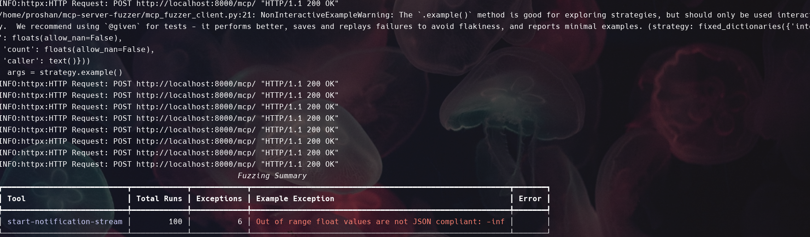

# MCP Fuzzer

A CLI tool for fuzzing MCP server tools using multiple transport protocols, with pretty output using [rich](https://github.com/Textualize/rich).

## Features
- **Multi-Protocol Support**: HTTP, SSE, Stdio, and WebSocket transports
- **Tool Discovery**: Automatically discovers available tools from MCP servers
- **Intelligent Fuzzing**: Uses Hypothesis to generate random/edge-case arguments
- **Rich Reporting**: Beautiful terminal tables with detailed statistics
- **Protocol Flexibility**: Easy to add new transport protocols

## Installation


```bash
pip install -e .
```

## Supported Protocols

### HTTP Transport
```bash
python mcp_fuzzer_client.py --protocol http --endpoint http://localhost:8080/rpc --runs 20
```

### SSE Transport
```bash
python mcp_fuzzer_client.py --protocol sse --endpoint http://localhost:8080/sse --runs 15
```

### Stdio Transport
```bash
python mcp_fuzzer_client.py --protocol stdio --endpoint "./bin/mcp-shell" --runs 10
```

### WebSocket Transport
```bash
python mcp_fuzzer_client.py --protocol websocket --endpoint ws://localhost:8080/ws --runs 25
```

## Usage

You can run the fuzzer as a CLI tool after install:

```bash
mcp-fuzzer-client --protocol http --endpoint http://localhost:8000/mcp/ --runs 10
```

Or directly with Python:

```bash
python mcp_fuzzer_client.py --protocol http --endpoint http://localhost:8000/mcp/ --runs 10
```

### Arguments
- `--protocol`: Transport protocol to use (http, sse, stdio, websocket)
- `--endpoint`: Server endpoint (URL for http/sse/websocket, command for stdio)
- `--runs`: Number of fuzzing runs per tool (default: 10)
- `--timeout`: Request timeout in seconds (default: 30.0)
- `--verbose`: Enable verbose logging

## Output

Results are shown in a colorized table with detailed statistics:
- **Success Rate**: Percentage of successful tool calls
- **Exception Count**: Number of exceptions during fuzzing
- **Example Exceptions**: Sample error messages for debugging
- **Overall Statistics**: Summary across all tools and protocols

---

**Project dependencies are managed via `pyproject.toml`.**

Test result of  fuzz testing of https://github.com/modelcontextprotocol/python-sdk/tree/main/examples/servers/simple-streamablehttp-stateless

