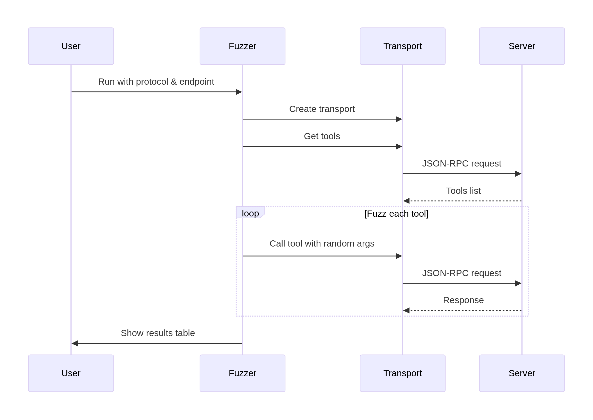
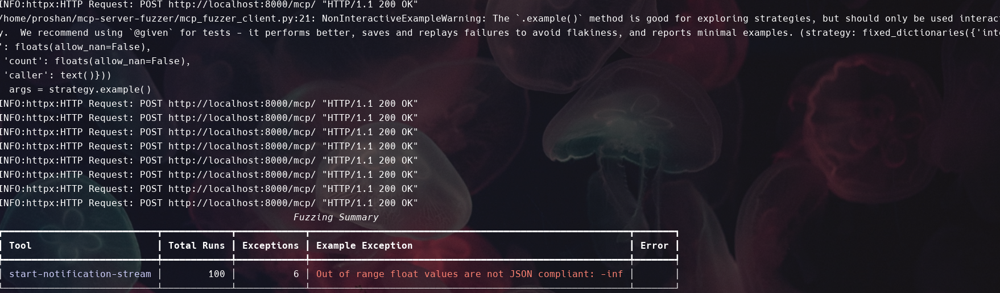

# MCP Fuzzer

A comprehensive CLI tool for fuzzing MCP servers using multiple transport protocols, with support for both **tool argument fuzzing** and **protocol type fuzzing**. Features pretty output using [rich](https://github.com/Textualize/rich).

[](https://github.com/Agent-Hellboy/mcp-server-fuzzer/actions/workflows/lint.yml)
[](https://pypi.org/project/mcp-fuzzer/)
[](https://pepy.tech/projects/mcp-fuzzer)

## Features

### Tool Fuzzer (Original)
- **Multi-Protocol Support**: HTTP, SSE, Stdio, and WebSocket transports
- **Tool Discovery**: Automatically discovers available tools from MCP servers
- **Intelligent Fuzzing**: Uses Hypothesis to generate random/edge-case arguments
- **Rich Reporting**: Beautiful terminal tables with detailed statistics
- **Protocol Flexibility**: Easy to add new transport protocols

### Protocol Fuzzer (New)
- **Comprehensive Protocol Coverage**: Fuzzes all MCP protocol types
- **Edge Case Generation**: Tests malformed requests, invalid parameters, and boundary conditions
- **Protocol-Specific Strategies**: Tailored fuzzing for each MCP message type
- **State-Aware Testing**: Tests protocol flow and state transitions
- **Security Testing**: Path traversal, injection attacks, and malformed data

## Architecture

The MCP Fuzzer uses a transport abstraction layer to support multiple protocols. Here's how it works:



## Installation

```bash
pip install mcp-fuzzer
```

## Usage

### Tool Fuzzer (Original Functionality)

Fuzz tool arguments and parameters:

```bash
# Basic tool fuzzing
mcp-fuzzer --mode tools --protocol http --endpoint http://localhost:8000/mcp/ --runs 10

# With verbose output
mcp-fuzzer --mode tools --protocol http --endpoint http://localhost:8000/mcp/ --verbose
```

### Protocol Fuzzer (New Functionality)

Fuzz MCP protocol types and messages:

```bash
# Fuzz all protocol types
mcp-fuzzer --mode protocol --protocol http --endpoint http://localhost:8000/mcp/ --runs-per-type 5

# Fuzz specific protocol type
mcp-fuzzer --mode protocol --protocol-type InitializeRequest --protocol http --endpoint http://localhost:8000/mcp/

# Fuzz with verbose output
mcp-fuzzer --mode protocol --protocol http --endpoint http://localhost:8000/mcp/ --verbose
```

## Supported Protocol Types

The protocol fuzzer covers all major MCP protocol types:

### Core Protocol
- **InitializeRequest**: Tests protocol version handling, client info, and capabilities
- **ProgressNotification**: Tests progress tokens, negative progress, and malformed notifications
- **CancelNotification**: Tests cancellation of unknown/completed requests

### Resource Management
- **ListResourcesRequest**: Tests pagination cursors and edge cases
- **ReadResourceRequest**: Tests URI parsing, path traversal, and malformed URIs
- **SubscribeRequest**: Tests resource subscription with invalid URIs
- **UnsubscribeRequest**: Tests resource unsubscription edge cases

### Logging & Configuration
- **SetLevelRequest**: Tests invalid logging levels and boundary conditions

### LLM & Sampling
- **CreateMessageRequest**: Tests large prompts, invalid tokens, and malformed messages
- **SamplingMessage**: Tests message content and role validation

### Prompt Management
- **ListPromptsRequest**: Tests prompt listing pagination
- **GetPromptRequest**: Tests prompt retrieval with invalid names

### Root Management
- **ListRootsRequest**: Tests root listing functionality

### Completion
- **CompleteRequest**: Tests completion with invalid references and arguments

### Generic JSON-RPC
- **GenericJSONRPCRequest**: Tests malformed JSON-RPC messages, missing fields, and invalid versions

## Supported Protocols

### HTTP Transport
```bash
mcp-fuzzer --mode tools --protocol http --endpoint http://localhost:8080/rpc --runs 20
mcp-fuzzer --mode protocol --protocol http --endpoint http://localhost:8080/rpc --runs-per-type 10
```

### SSE Transport
```bash
mcp-fuzzer --mode tools --protocol sse --endpoint http://localhost:8080/sse --runs 15
mcp-fuzzer --mode protocol --protocol sse --endpoint http://localhost:8080/sse --runs-per-type 8
```

### Stdio Transport
```bash
# Binary executables
mcp-fuzzer --mode tools --protocol stdio --endpoint "./bin/mcp-shell" --runs 10
mcp-fuzzer --mode protocol --protocol stdio --endpoint "./bin/mcp-shell" --runs-per-type 5

# Python scripts
mcp-fuzzer --mode tools --protocol stdio --endpoint "python3 ./my-mcp-server.py" --runs 10
mcp-fuzzer --mode protocol --protocol stdio --endpoint "python3 ./my-mcp-server.py" --runs-per-type 5
```

### WebSocket Transport
```bash
mcp-fuzzer --mode tools --protocol websocket --endpoint ws://localhost:8080/ws --runs 25
mcp-fuzzer --mode protocol --protocol websocket --endpoint ws://localhost:8080/ws --runs-per-type 12
```

## Arguments

### Common Arguments
- `--mode`: Fuzzing mode (`tools` or `protocol`, default: `tools`)
- `--protocol`: Transport protocol to use (http, sse, stdio, websocket)
- `--endpoint`: Server endpoint (URL for http/sse/websocket, command for stdio)
- `--timeout`: Request timeout in seconds (default: 30.0)
- `--verbose`: Enable verbose logging

### Tool Fuzzer Arguments
- `--runs`: Number of fuzzing runs per tool (default: 10)

### Protocol Fuzzer Arguments
- `--runs-per-type`: Number of fuzzing runs per protocol type (default: 5)
- `--protocol-type`: Fuzz only a specific protocol type (optional)

## Output

Results are shown in colorized tables with detailed statistics:

### Tool Fuzzer Output
- **Success Rate**: Percentage of successful tool calls
- **Exception Count**: Number of exceptions during fuzzing
- **Example Exceptions**: Sample error messages for debugging
- **Overall Statistics**: Summary across all tools and protocols

### Protocol Fuzzer Output
- **Protocol Type**: The specific MCP protocol type being tested
- **Total Runs**: Number of fuzz attempts for this protocol type
- **Successful**: Number of successful protocol interactions
- **Exceptions**: Number of exceptions or errors encountered
- **Success Rate**: Percentage of successful protocol interactions
- **Example Exception**: Sample error messages for debugging

## Edge Cases Tested

The protocol fuzzer generates comprehensive edge cases including:

### InitializeRequest
- Invalid protocol versions
- Malformed client info
- Invalid capabilities structures
- Empty or missing fields

### ProgressNotification
- Negative progress values
- Invalid progress tokens
- Missing required fields
- Malformed progress structures

### ReadResourceRequest
- Path traversal attempts (`../../../etc/passwd`)
- Invalid URI schemes
- Extremely long URIs
- Unicode and special characters in paths
- Data URIs with malformed content

### SetLevelRequest
- Invalid logging levels
- Numeric and boolean values instead of strings
- Empty or malformed level strings
- Boundary testing of log systems

### Generic JSON-RPC
- Missing `jsonrpc` field
- Invalid JSON-RPC versions
- Missing request IDs
- Deeply nested parameters
- Malformed JSON-RPC structures

## Examples

### Testing a Simple MCP Server

```bash
# Start your MCP server
python my-mcp-server.py

# In another terminal, fuzz the tools
mcp-fuzzer --mode tools --protocol http --endpoint http://localhost:8000/mcp/ --runs 20

# Fuzz the protocol types
mcp-fuzzer --mode protocol --protocol http --endpoint http://localhost:8000/mcp/ --runs-per-type 10
```

### Testing Specific Protocol Vulnerabilities

```bash
# Test initialization edge cases
mcp-fuzzer --mode protocol --protocol-type InitializeRequest --protocol http --endpoint http://localhost:8000/mcp/ --runs-per-type 20

# Test resource reading with path traversal
mcp-fuzzer --mode protocol --protocol-type ReadResourceRequest --protocol http --endpoint http://localhost:8000/mcp/ --runs-per-type 15

# Test logging level boundary conditions
mcp-fuzzer --mode protocol --protocol-type SetLevelRequest --protocol http --endpoint http://localhost:8000/mcp/ --runs-per-type 10
```

## Development

### Running Tests

```bash
# Test the protocol fuzzer
python examples/test_protocol_fuzzer.py

# Run the full test suite
python -m pytest tests/
```

### Adding New Protocol Types

To add fuzzing for a new MCP protocol type:

1. Add a new method to `MCPProtocolFuzzer` in `protocol_fuzzer.py`
2. Add the protocol type to the mapping in `protocol_client.py`
3. Add the send method in `protocol_client.py`
4. Update the protocol types list in `fuzz_all_protocol_types()`

---

**Project dependencies are managed via `pyproject.toml`.**

Test result of fuzz testing of https://github.com/modelcontextprotocol/python-sdk/tree/main/examples/servers/simple-streamablehttp-stateless


