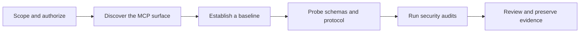

# MCP Server Fuzzer

An evidence-producing command-line tool for authorized security research and
assessment of live [Model Context Protocol (MCP)](https://modelcontextprotocol.io/)
servers.

[](https://github.com/Agent-Hellboy/mcp-server-fuzzer/actions/workflows/tests.yml)
[](https://github.com/Agent-Hellboy/mcp-server-fuzzer/actions/workflows/lint.yml)
[](https://codecov.io/gh/Agent-Hellboy/mcp-server-fuzzer)
[](https://pypi.org/project/mcp-fuzzer/)
[](https://pepy.tech/projects/mcp-fuzzer)
[](https://modelcontextprotocol.io/specification/2025-11-25/)
[](https://hub.docker.com/r/princekrroshan01/mcp-fuzzer)
[](https://opensource.org/licenses/MIT)
[](https://www.python.org/downloads/)

**[Documentation](https://agent-hellboy.github.io/mcp-server-fuzzer/)** |
**[Assessment workflow](https://agent-hellboy.github.io/mcp-server-fuzzer/getting-started/audit-workflow/)** |
**[CLI reference](https://agent-hellboy.github.io/mcp-server-fuzzer/development/reference/)** |
**[Releases](https://github.com/Agent-Hellboy/mcp-server-fuzzer/releases)**

## What this tool is for

MCP Server Fuzzer helps a security researcher answer practical assessment
questions against an authorized target:

- What tools, resources, prompts, protocol methods, and authentication boundary
  does the server expose?
- Does it reject malformed and boundary inputs, or accept data outside its
  advertised contract?
- Do tool descriptions or schemas contain poisoning, hidden instructions,
  duplicate definitions, or dangerous capability combinations?
- Does an advertised OAuth boundary publish unsafe metadata or expose tools
  without the expected authentication?
- What does a local stdio server actually execute, read, write, or connect to
  while a test runs?
- Can another analyst reproduce and review the observation from saved evidence?

The tool is black-box and server-facing. It reports observations, signals, and
reproduction data; it is not a source-code SAST tool, a certification, or proof
of exploitability in every deployment.

## Assessment model


```mermaid
flowchart LR
    S[Scope and authorize] --> D[Discover the MCP surface]
    D --> B[Establish a baseline]
    B --> P[Probe schemas and protocol]
    P --> A[Run security audits]
    A --> E[Review and preserve evidence]
```

The [assessment workflow](https://agent-hellboy.github.io/mcp-server-fuzzer/getting-started/audit-workflow/)
explains what to record at each stage. Start with low run counts, bounded
timeouts, dedicated credentials, and an isolated target.

## Install

Requires Python 3.10 or newer.

```bash
python -m pip install mcp-fuzzer
mcp-fuzzer --help
```

For optional observation of local stdio processes:

```bash
python -m pip install "mcp-fuzzer[mcpfz-probe]"
```

The Docker image is available from
[princekrroshan01/mcp-fuzzer](https://hub.docker.com/r/princekrroshan01/mcp-fuzzer):

```bash
docker pull princekrroshan01/mcp-fuzzer:latest
docker run --rm princekrroshan01/mcp-fuzzer:latest --help
```

## Run a first assessment

Against a local or remote Streamable HTTP target:

```bash
mcp-fuzzer \
  --mode tools \
  --protocol streamablehttp \
  --endpoint http://localhost:8000/mcp \
  --phase realistic \
  --runs 10 \
  --security-audit \
  --seed 42 \
  --output-dir reports/baseline
```

Against a local stdio target, use a disposable filesystem root and deny
non-local network access:

```bash
mcp-fuzzer \
  --mode all \
  --protocol stdio \
  --endpoint "python my_server.py" \
  --enable-safety-system \
  --fs-root "$PWD/fuzz-sandbox" \
  --no-network \
  --runs 5 \
  --output-dir reports/baseline
```

Only test systems and endpoints you are authorized to assess. The safety
controls reduce accidental impact; they are not a substitute for a container,
VM, or an engagement-specific network boundary.

## Evidence and findings

Sessions write machine-readable evidence to `--output-dir`, including:

- `run_summary.json` — completion status, discovery state, counts, and target
  metadata.
- `findings.json` — normalized security and reliability observations with
  evidence, severity, target, run identifiers, and source links.
- `crashes/` — available reproductions and related server output.
- Optional CSV, XML, HTML, and Markdown exports.

Review [understand run results](https://agent-hellboy.github.io/mcp-server-fuzzer/getting-started/results/)
before sharing artifacts. Requests, generated arguments, responses, paths, and
runtime observations may contain sensitive data. The CLI masks sensitive values
in its startup configuration display, but generated reports still require
restricted storage and analyst redaction.

## Security audit surfaces

Use `--security-audit` for tool and schema checks plus active output oracles
that have evidence from the same run. Use `--auth-audit` for read-only OAuth
metadata, authorization-endpoint, and unauthenticated-tool checks. Add
`--auth-audit-intrusive` only when the authorization explicitly covers dynamic
client registration and redirect handling.

Use `--runtime-probe` only for authorized local stdio targets when process,
filesystem, network, credential, privilege, or ptrace observations are in
scope. The optional `mcpfz-probe` sidecar is disabled by default and fails open
if it cannot observe the target.

## Documentation

- [Choose an assessment path](https://agent-hellboy.github.io/mcp-server-fuzzer/getting-started/)
- [Run the assessment workflow](https://agent-hellboy.github.io/mcp-server-fuzzer/getting-started/audit-workflow/)
- [Use focused audit recipes](https://agent-hellboy.github.io/mcp-server-fuzzer/getting-started/examples/)
- [Interpret evidence and findings](https://agent-hellboy.github.io/mcp-server-fuzzer/getting-started/results/)
- [Configure repeatable assessments](https://agent-hellboy.github.io/mcp-server-fuzzer/configuration/configuration/)
- [Contain local targets](https://agent-hellboy.github.io/mcp-server-fuzzer/components/safety/)
- [Automate evidence collection in CI](https://agent-hellboy.github.io/mcp-server-fuzzer/security-ci/)
- [Read the CLI reference](https://agent-hellboy.github.io/mcp-server-fuzzer/development/reference/)

The architecture and contributor pages remain available for maintainers who
need implementation context.

## External security context

The audit language in this project is intended to complement, not replace, the
[MCP Security Best Practices](https://modelcontextprotocol.io/docs/tutorials/security/security_best_practices),
the [MCP authorization specification](https://modelcontextprotocol.io/specification/2025-11-25/basic/authorization),
and the [OWASP MCP Top 10](https://owasp.org/www-project-mcp-top-10/).

## License

MIT. See [LICENSE](LICENSE).
