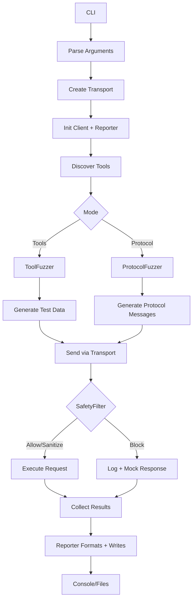
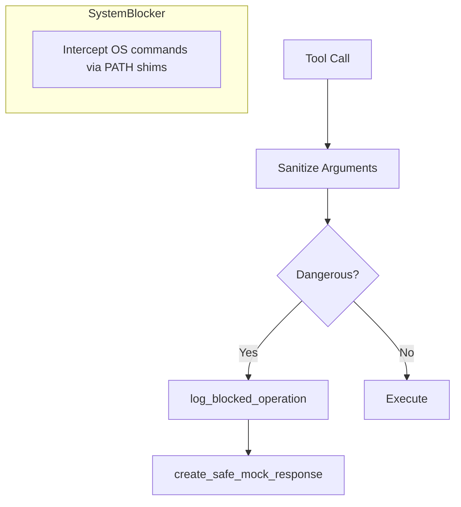
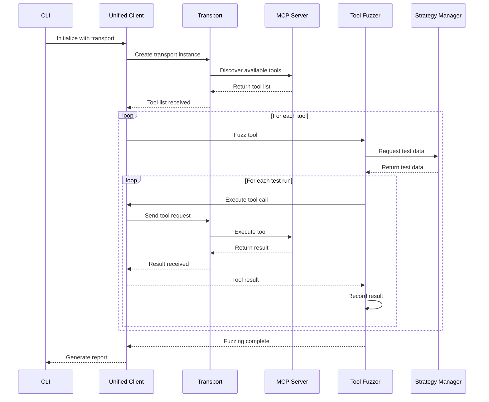
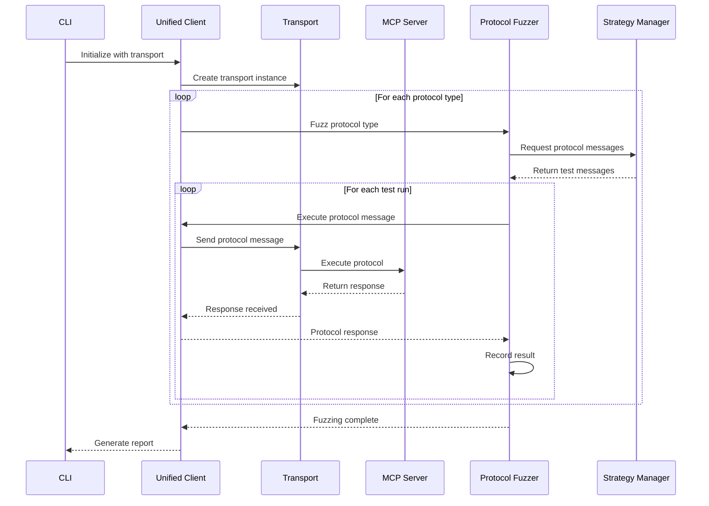

# Architecture

This document describes the architecture and design of the MCP Server Fuzzer system.

## System Overview

The MCP Server Fuzzer is built with a modular, layered architecture that separates concerns and provides clear interfaces between components. The system is designed to be:

- **Protocol Agnostic**: Fuzzer logic is independent of transport protocols
- **Extensible**: Easy to add new transport protocols and fuzzing strategies
- **Safe**: Built-in safety mechanisms protect against dangerous operations
- **Testable**: Each component can be tested independently

## 🧩 Core Components

### High-Level Architecture

```mermaid
graph TB
    subgraph "CLI Layer"
        A1[Args Parser]
        A2[Main CLI]
        A3[Runner]
    end

    subgraph "Client"
        B1[UnifiedMCPFuzzerClient]
        B2[Safety Integration]
        B3[Reporting Integration]
    end

    subgraph "Transports"
        C1[HTTP]
        C2[SSE]
        C3[STDIO]
    end

    subgraph "Fuzz Engine"
        D1[ToolFuzzer]
        D2[ProtocolFuzzer]
        D3[Strategy Manager]
    end

    subgraph "Runtime"
        R1[ProcessManager]
        R2[ProcessWatchdog]
        R3[AsyncProcessWrapper]
    end

    subgraph "Safety System"
        E1[SafetyFilter]
        E2[SystemBlocker]
    end

    subgraph "Reports"
        F1[FuzzerReporter]
        F2[Formatters (Console/JSON/Text)]
        F3[SafetyReporter]
    end

    A1 --> B1
    A2 --> B1
    A3 --> B1

    B1 --> C1
    B1 --> C2
    B1 --> C3
    B1 --> D1
    B1 --> D2
    B1 --> F1

    D1 --> E1
    D2 --> E1

    C3 -.-> R1
    R1 --> R2

    B1 --> E1
    E1 --> F3
    F1 --> F2
```

## \U0001F4C4 Data Flow

### Main Execution Flow



### Safety System Flow



## \U0001F4C1 Project Structure

```
mcp_fuzzer/
├── cli/                    # Command-line interface
│   ├── __init__.py
│   ├── args.py            # Argument parsing and validation
│   ├── main.py            # Main CLI entry point
│   └── runner.py          # CLI execution logic
├── transport/              # Transport layer implementations
│   ├── __init__.py
│   ├── base.py            # Abstract transport protocol
│   ├── factory.py         # Transport factory
│   ├── http.py            # HTTP/HTTPS transport
│   ├── sse.py             # Server-Sent Events transport
│   └── stdio.py           # Standard I/O transport
├── fuzz_engine/            # Fuzzing engine
│   ├── __init__.py
│   ├── fuzzer/            # Core fuzzing logic
│   │   ├── __init__.py
│   │   ├── tool_fuzzer.py     # Tool-level fuzzing
│   │   └── protocol_fuzzer.py # Protocol-level fuzzing
│   ├── strategy/           # Fuzzing strategies
│   │   ├── __init__.py
│   │   ├── realistic/         # Realistic data generation
│   │   │   ├── __init__.py
│   │   │   ├── protocol_type_strategy.py
│   │   │   └── tool_strategy.py
│   │   ├── aggressive/        # Aggressive attack vectors
│   │   │   ├── __init__.py
│   │   │   ├── protocol_type_strategy.py
│   │   │   └── tool_strategy.py
│   │   └── strategy_manager.py # Strategy orchestration
│   └── runtime/            # Process management and runtime
│       ├── __init__.py
│       ├── manager.py      # Process manager
│       ├── watchdog.py     # Process monitoring
│       └── wrapper.py      # Async process wrapper
├── reports/                # Reporting and output system
│   ├── __init__.py
│   ├── reporter.py         # Main reporting coordinator
│   ├── formatters.py       # Output formatters (Console, JSON, Text)
│   └── safety_reporter.py  # Safety system reporting
├── safety_system/          # Safety and protection
│   ├── __init__.py
│   ├── safety.py          # Core safety logic
│   └── system_blocker.py  # System command blocking
├── auth/                   # Authentication providers
│   ├── __init__.py
│   ├── providers.py        # Auth provider implementations
│   ├── manager.py          # Auth management
│   └── loaders.py          # Configuration loading
├── client.py               # Unified MCP client
└── __main__.py            # Entry point for module execution
```

## 🔌 Component Details

### 1. CLI Layer

The CLI layer provides the user interface and handles argument parsing, validation, and execution flow.

**Key Components:**

- `args.py`: Defines and validates command-line arguments
- `main.py`: Main entry point that orchestrates the CLI
- `runner.py`: Executes the fuzzing logic based on parsed arguments

**Responsibilities:**

- Parse and validate user input
- Create appropriate transport instances
- Initialize the fuzzing client
- Handle errors and display results

### 2. Transport Layer

The transport layer abstracts communication with MCP servers, supporting multiple protocols.

**Key Components:**

- `base.py`: Abstract TransportProtocol class defining the interface
- `factory.py`: Factory function for creating transport instances
- `http.py`: HTTP/HTTPS transport implementation
- `sse.py`: Server-Sent Events transport implementation
- `stdio.py`: Standard I/O transport for local processes

**Transport Protocol Interface:**

```python
class TransportProtocol(ABC):
    async def send_request(self, method: str, params=None) -> Any
    async def send_raw(self, payload: Any) -> Any
    async def send_notification(self, method: str, params=None) -> None
    async def get_tools(self) -> List[Dict[str, Any]]
    async def call_tool(self, name: str, arguments: Dict[str, Any]) -> Any
```

### 3. Fuzzing Engine

The fuzzing engine orchestrates the testing process and manages test execution.

**Key Components:**

- `tool_fuzzer.py`: Tests individual tools with various argument combinations
- `protocol_fuzzer.py`: Tests MCP protocol types with various message structures

**Fuzzing Process:**

1. **Discovery**: Automatically discover available tools from the server
2. **Strategy Selection**: Choose appropriate fuzzing strategy (realistic vs aggressive)
3. **Data Generation**: Generate test data using Hypothesis and custom strategies
4. **Execution**: Execute tests and collect results
5. **Analysis**: Analyze results and generate reports

### 4. Strategy System

The strategy system generates test data using different approaches.

**Key Components:**

- `realistic/`: Generates valid, realistic data for functionality testing
- `aggressive/`: Generates malicious/malformed data for security testing
- `strategy_manager.py`: Orchestrates strategy selection and execution

**Strategy Types:**

- **Realistic Strategies**: Generate valid Base64, UUIDs, timestamps, semantic versions
- **Aggressive Strategies**: Generate SQL injection, XSS, path traversal, buffer overflow attempts

### 5. Safety System

The safety system provides multiple layers of protection against dangerous operations.

**Key Components:**

- `safety.py`: Core safety logic and filtering
- `system_blocker.py`: System command blocking and PATH shimming

**Safety Features:**

- **SafetyFilter**: Centralized filter for all tool and protocol calls
- **System Command Blocking**: Prevents execution of dangerous commands (PATH shims)
- **Filesystem Sandboxing**: Confines file operations to specified directories
- **Process Isolation**: Safe subprocess handling with timeouts
- **Input Sanitization**: Filters potentially dangerous input

### 6. Authentication System

The authentication system manages various authentication methods for MCP servers.

**Key Components:**

- `providers.py`: Authentication provider implementations
- `manager.py`: Authentication management and coordination
- `loaders.py`: Configuration loading from files and environment

**Supported Auth Types:**

- **API Key authentication**
- **Basic username/password authentication**
- **OAuth token authentication**
- **Custom header authentication**

### 7. Reporting System

The reporting system provides centralized output management and comprehensive result reporting.

**Key Components:**

- `reporter.py`: Main `FuzzerReporter` class that coordinates all reporting
- `formatters.py`: Output formatters for different formats (Console, JSON, Text)
- `safety_reporter.py`: Dedicated safety system reporting and statistics

**Reporting Features:**

- **Console Output**: Rich, formatted tables with colors and progress tracking
- **File Export**: JSON and text reports for analysis and documentation
- **Result Aggregation**: Comprehensive statistics and success rate calculations
- **Safety Reporting**: Detailed breakdown of blocked operations and risk assessments
- **Session Tracking**: Timestamped reports with unique session identification

**Output Formats:**

- **Console**: Interactive tables and progress indicators
- **JSON**: Machine-readable structured data for external analysis
- **Text**: Human-readable summaries for sharing and documentation

**Report Types:**

- **Fuzzing Reports**: Complete tool and protocol testing results
- **Safety Reports**: Detailed safety system data and blocked operations
- **Session Reports**: Metadata, configuration, and execution statistics

## \U0001F4C4 Execution Flow

### Tool Fuzzing Flow



### Protocol Fuzzing Flow



## Design Principles

### 1. Separation of Concerns

Each component has a single, well-defined responsibility:

- **Transport Layer**: Handles communication protocols
- **Fuzzing Engine**: Manages test execution
- **Strategy System**: Generates test data
- **Safety System**: Provides protection mechanisms

### 2. Protocol Agnosticism

The fuzzer logic is completely independent of transport protocols:

- **Fuzzing strategies work** with any transport
- **New transports can be added** without changing fuzzer logic
- **Transport-specific details** are encapsulated

### 3. Extensibility

The system is designed for easy extension:

- **New transport protocols** can be added by implementing the interface
- **New fuzzing strategies** can be added to the strategy system
- **New safety features** can be added to the safety system

### 4. Safety First

Safety is built into every layer:

- **Environment detection** prevents dangerous operations
- **Input sanitization** filters potentially dangerous data
- **System command blocking** prevents command execution
- **Filesystem sandboxing** confines file operations

### 5. Testability

Each component can be tested independently:

- **Clear interfaces** between components
- **Dependency injection** for external dependencies
- **Comprehensive mocking** support
- **Isolated test environments**

## Configuration Management

### Environment Variables

The system uses environment variables for configuration:

```bash
# Core configuration
export MCP_FUZZER_TIMEOUT=30.0
export MCP_FUZZER_LOG_LEVEL=INFO
export MCP_FUZZER_SAFETY_ENABLED=true

# Transport configuration
export MCP_FUZZER_HTTP_TIMEOUT=30.0
export MCP_FUZZER_SSE_TIMEOUT=30.0
export MCP_FUZZER_STDIO_TIMEOUT=30.0

# Safety configuration
export MCP_FUZZER_FS_ROOT=~/.mcp_fuzzer
export MCP_FUZZER_ENABLE_SAFETY=true
export MCP_FUZZER_DANGEROUS_TESTS_DISABLED=false
```

## Performance Considerations

### Asynchronous Design

The system uses async/await throughout for better performance:

- **Non-blocking I/O operations**
- **Concurrent tool execution**
- **Efficient resource utilization**

### Resource Management

Careful resource management ensures stability:

- **Connection pooling** for HTTP transport
- **Process lifecycle management** for stdio transport
- **Memory-efficient data generation**
- **Timeout handling** for all operations

### Scalability

The architecture supports scaling:

- **Multiple worker processes**
- **Distributed fuzzing** across machines
- **Configurable concurrency limits**
- **Resource usage monitoring**

## Security Considerations

### Input Validation

All input is validated and sanitized:

- **Argument validation** at CLI level
- **Transport-level input sanitization**
- **Safety system filtering**
- **Environment variable validation**

### Access Control

The system implements access control:

- **Filesystem sandboxing**
- **Process isolation**
- **System command blocking**
- **Environment detection**

### Audit Logging

Comprehensive logging for security:

- **All operations are logged**
- **Safety system actions are recorded**
- **Error conditions are tracked**
- **Performance metrics are collected**

## Monitoring and Observability

### Metrics Collection

The system collects various metrics:

- **Request success/failure rates**
- **Response times**
- **Error counts and types**
- **Resource usage**

### Logging

Comprehensive logging throughout:

- **Structured logging** with levels
- **Context-aware log messages**
- **Performance timing information**
- **Error stack traces**

### Health Checks

Built-in health monitoring:

- **Transport connectivity checks**
- **Server availability monitoring**
- **Safety system status**
- **Resource usage monitoring**
