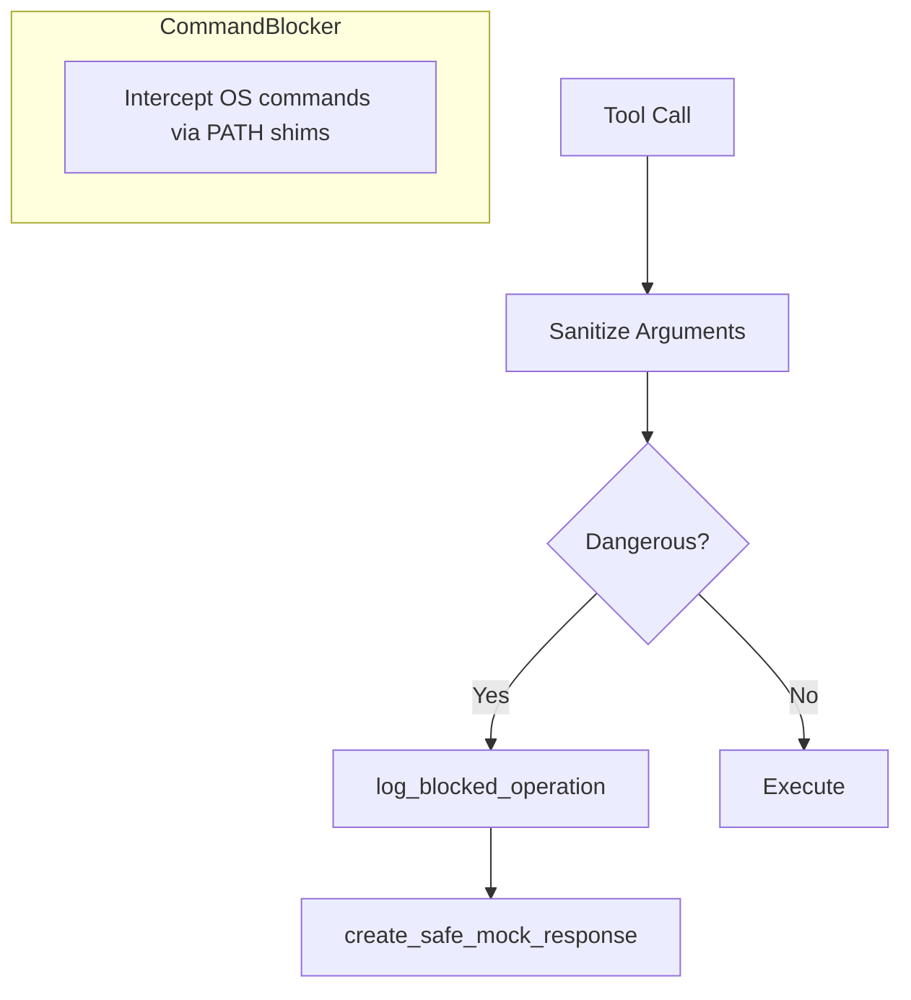
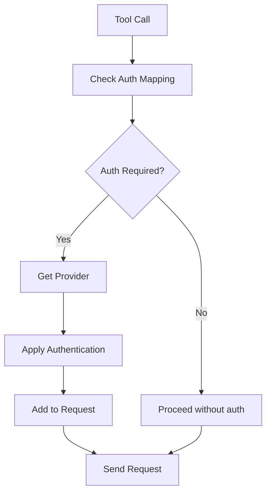
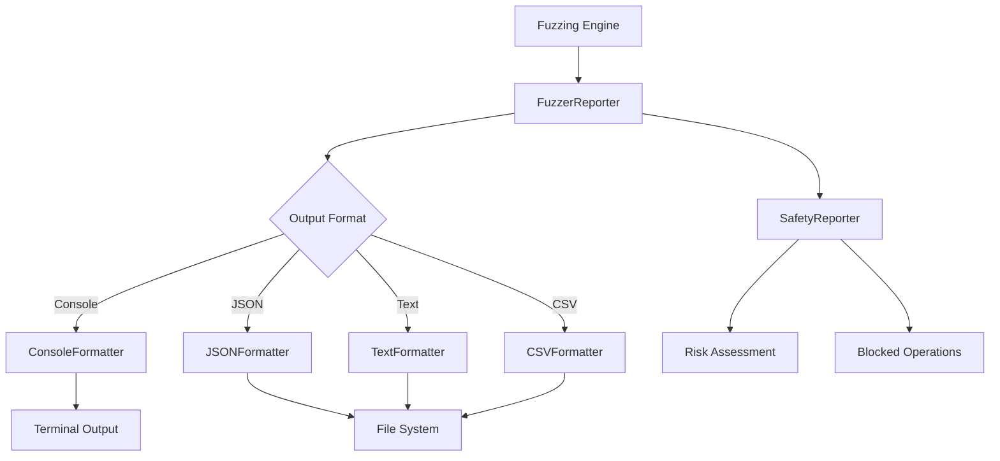
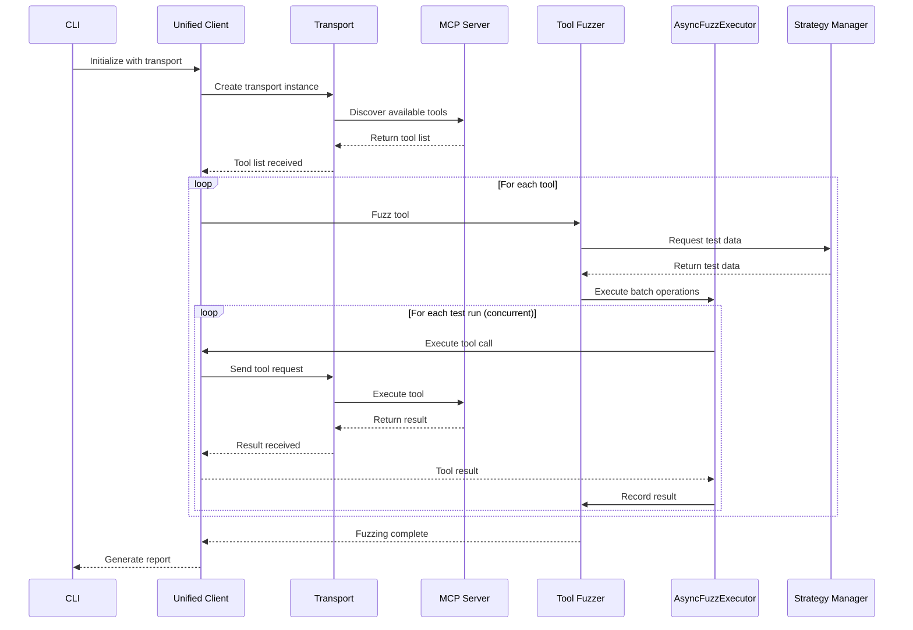
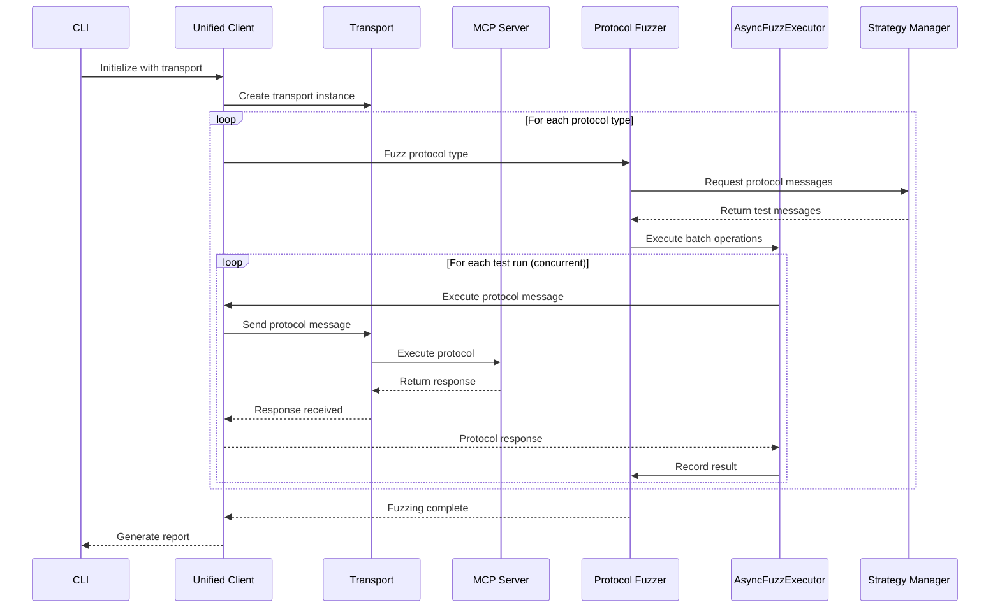
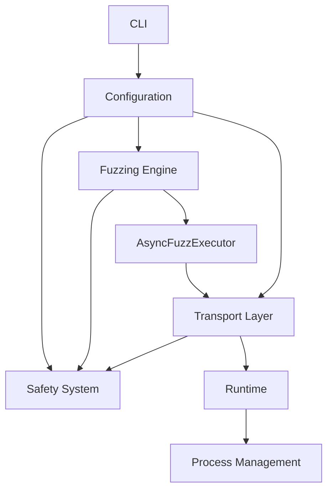

# Architecture

This document describes the architecture and design of the MCP Server Fuzzer system.

## System Overview

The MCP Server Fuzzer is built with a modular, layered architecture that separates concerns and provides clear interfaces between components. The system is designed to be:

- **Protocol Agnostic**: Fuzzer logic is independent of transport protocols
- **Extensible**: Easy to add new transport protocols and fuzzing strategies
- **Safe**: Built-in safety mechanisms protect against dangerous operations
- **Testable**: Each component can be tested independently

## Core Components

### High-Level Architecture

```mermaid
flowchart TB
  subgraph CLI_Layer
    A1[Parser (cli/parser.py)]
    A2[Config Merge (cli/config_merge.py)]
    A3[Validation Manager (cli/validators.py)]
    A4[Entrypoint runner (cli/entrypoint.py)]
  end

  subgraph Client
    B1[UnifiedMCPFuzzerClient (client/main.py)]
    B2[Safety Integration]
    B3[Reporting Integration]
  end

  subgraph Transports
    C1[HTTP]
    C2[SSE]
    C3[STDIO]
    C4[Custom Drivers]
  end

  subgraph Fuzz_Engine
    D1[ToolExecutor]
    D2[ProtocolExecutor]
    D3[Mutators]
    D4[AsyncFuzzExecutor]
    D5[FuzzerReporter]
  end

  subgraph Runtime[Async Runtime]
    R1[ProcessManager]
    R2[ProcessWatchdog]
    R3[Process Lifecycle]
    R4[Signal Handling]
  end

  subgraph Safety_System
    E1[SafetyFilter]
    E2[SystemCommandBlocker]
    E3[Network Policy]
  end

  subgraph Reports
    F1[FuzzerReporter]
    F2[Formatters]
    F3[SafetyReporter]
  end

  A1 --> A2 --> A3 --> A4
  A4 --> B1

  B1 --> C1
  B1 --> C2
  B1 --> C3
  B1 --> C4
  B1 --> D1
  B1 --> D2
  B1 --> F1

  D1 --> E1
  D2 --> E1
  D1 --> D4
  D2 --> D4

  C3 -.-> R1
  R1 --> R2
  R2 -.-> R3
  R1 -.-> R4

  B1 --> E1
  E1 --> F3
  F1 --> F2
  C1 -.-> E3
```

## Data Flow

### Main Execution Flow

```mermaid
graph TD
    A[CLI] --> B[Parse Arguments]
    B --> C[Merge CLI + Config]
    C --> D[Validate Args/Env/Transport]
    D --> E[Create Transport (build_driver)]
    E --> F[Init Client + Reporter]
    F --> G[Discover Tools]
    G --> H{Mode}

    H -->|Tools| I[ToolExecutor]
    H -->|Protocol| J[Spec Guard] --> K[ProtocolExecutor]

    I --> L[ToolMutator]
    K --> M[ProtocolMutator]

    L --> N[AsyncFuzzExecutor]
    M --> N
    N --> O[Send via Transport]

    O --> P{SafetyFilter}
    P -->|Block| Q[Log + Mock Response]
    P -->|Allow/Sanitize| R[Execute Request]

    R --> S[Collect Results]
    Q --> S

    S --> T[Reporter Formats + Writes]
    T --> U[Console/Files]
```

### Safety System Flow



## Project Structure

```text
mcp_fuzzer/
├── cli/           # CLI parsing, validation, config merge, entrypoint
├── client/        # Unified client orchestration and runtime wiring
├── config/        # Config loader, schema validation, custom transport hooks
├── fuzz_engine/   # Mutators, executors, runtime, reporting
├── transport/     # Drivers, interfaces, catalogs, controllers
├── safety_system/ # Safety filter, sandboxing, command blocking
├── reports/       # Reporting + standardized output
└── auth/          # Authentication providers and manager
```

### 1. CLI Layer

The CLI layer provides the user interface and handles argument parsing, validation, and execution flow.

**Key Components:**

- `cli/parser.py`: Defines command-line arguments and help text
- `cli/entrypoint.py`: Main CLI entry point that orchestrates execution
- `cli/validators.py`: Validates arguments and environment variables
- `cli/config_merge.py`: Merges CLI args with configuration files

**Responsibilities:**

- Parse and validate user input
- Load configuration defaults
- Initialize the fuzzing client
- Handle errors and display results

### 2. Transport Layer

The transport layer abstracts communication with MCP servers, supporting multiple protocols with built-in safety integration.

**Key Components:**

- `interfaces/driver.py`: Abstract TransportDriver interface
- `catalog/builder.py`: Factory function for creating transport instances
- `catalog/catalog.py`: DriverCatalog registry
- `drivers/http_driver.py`: HTTP/HTTPS transport implementation
- `drivers/stream_http_driver.py`: Streamable HTTP transport implementation
- `drivers/sse_driver.py`: Server-Sent Events transport implementation
- `drivers/stdio_driver.py`: Standard I/O transport implementation
- `interfaces/behaviors.py`: Reusable transport behaviors and utilities
- `catalog/custom_catalog.py`: Custom transport registry helpers

**Transport Driver Interface:**

```python
class TransportDriver(ABC):
    async def send_request(self, method: str, params=None) -> Any
    async def send_raw(self, payload: dict[str, Any]) -> Any
    async def send_notification(self, method: str, params=None) -> None
    async def connect(self) -> None
    async def disconnect(self) -> None
    async def stream_request(self, payload: dict[str, Any]) -> AsyncIterator[dict[str, Any]]
    async def _stream_request(self, payload: dict[str, Any]) -> AsyncIterator[dict[str, Any]]
```

### 3. Fuzzing Engine

The fuzzing engine orchestrates the testing process through three specialized modules: Mutators, Executor, and FuzzerReporter.

**Key Components:**

- `mutators/`: Data generation and mutation module
  - `ToolMutator`: Generates fuzzed tool arguments
  - `ProtocolMutator`: Generates fuzzed protocol messages
  - `BatchMutator`: Generates batch requests
  - `strategies/`: Comprehensive strategy system with realistic and aggressive modes
- `executor/`: Execution orchestration module
  - `ToolExecutor`: Orchestrates tool fuzzing with safety integration
  - `ProtocolExecutor`: Orchestrates protocol fuzzing with invariant validation
  - `BatchExecutor`: Orchestrates batch fuzzing
  - `AsyncFuzzExecutor`: Async execution framework with concurrency control
  - `invariants.py`: Property-based testing invariants
- `fuzzerreporter/`: Result collection and reporting module
  - `ResultBuilder`: Creates standardized result dictionaries
  - `ResultCollector`: Aggregates results from multiple runs
  - `MetricsCalculator`: Calculates comprehensive metrics
- `runtime/`: Process management and monitoring

**Fuzzing Process:**

1. **Discovery**: Automatically discover available tools from the server
2. **Strategy Selection**: Choose appropriate fuzzing strategy (realistic vs aggressive)
3. **Data Generation**: Mutators generate test data using strategies and JSON Schema
4. **Execution**: Executors manage concurrent execution via AsyncFuzzExecutor
5. **Safety Checks**: Safety system validates and sanitizes operations
6. **Invariant Verification**: Verify responses against property-based invariants
7. **Result Collection**: FuzzerReporter collects and aggregates results
8. **Metrics Calculation**: Calculate success rates, violations, and statistics
9. **Reporting**: Generate comprehensive reports in multiple formats

**See [Fuzz Engine Architecture](./fuzz-engine.md) for detailed documentation.**

### 4. Runtime Management System

The runtime management system provides robust, asynchronous subprocess lifecycle management for transports and target servers under test.

**Key Components:**

- `manager.py`: Fully async ProcessManager for start/stop processes, send signals, await exit, collect stats
- `watchdog.py`: ProcessWatchdog for monitoring registered PIDs for hangs/inactivity and terminating them based on policy
- `executor.py`: AsyncFuzzExecutor providing concurrency control, error handling, and result aggregation

**Runtime Features:**

- **Fully Async API**: All operations use native asyncio; blocking calls run in thread executors
- **Process-Group Signaling**: On POSIX systems, uses process-group signaling to prevent orphan children
- **Safe Stop Flow**: TERM (grace window) → KILL on timeout if needed
- **Watchdog Auto-Management**: Auto-starts on first registration/start; auto-unregisters on stop
- **Activity Monitoring**: Supports activity callbacks for hang detection
- **Concurrency Control**: Bounded concurrency with semaphore-based limiting
- **Retry Mechanisms**: Configurable retry with exponential backoff
- **Batch Operations**: Execute multiple operations concurrently with result collection

### 5. Strategy System

The strategy system generates test data using different approaches.

**Key Components:**

- `realistic/`: Generates valid, realistic data for functionality testing
- `aggressive/`: Generates malicious/malformed data for security testing
- `strategy_manager.py`: Orchestrates strategy selection and execution
- `schema_parser.py`: Parses JSON Schema definitions to generate appropriate test data

**Strategy Types:**

- **Realistic Strategies**: Generate valid Base64, UUIDs, timestamps, semantic versions
- **Aggressive Strategies**: Generate SQL injection, XSS, path traversal, buffer overflow attempts

**Schema Parser:**

The schema parser provides comprehensive support for parsing JSON Schema definitions and generating appropriate test data based on schema specifications. It handles:

- Basic types: string, number, integer, boolean, array, object, null
- String constraints: minLength, maxLength, pattern, format
- Number/Integer constraints: minimum, maximum, exclusiveMinimum, exclusiveMaximum, multipleOf
- Array constraints: minItems, maxItems, uniqueItems
- Object constraints: required properties, minProperties, maxProperties
- Schema combinations: oneOf, anyOf, allOf
- Enums and constants

The module supports both "realistic" and "aggressive" fuzzing strategies, where realistic mode generates valid data conforming to the schema, while aggressive mode intentionally generates edge cases and invalid data to test error handling.

### 6. Invariants System

The invariants system provides comprehensive property-based testing capabilities to verify response validity, error type correctness, and prevention of unintended crashes or unexpected states during fuzzing.

**Key Components:**

- `check_response_validity`: Ensures responses follow JSON-RPC 2.0 specification with proper field validation
- `check_error_type_correctness`: Verifies error responses have correct structure, codes, and message types
- `check_response_schema_conformity`: Validates responses against JSON schema definitions using jsonschema
- `verify_response_invariants`: Orchestrates multiple invariant checks on a single response
- `verify_batch_responses`: Applies invariant checks to batches of responses asynchronously
- `check_state_consistency`: Ensures server state remains consistent during fuzzing operations

**Invariant Types:**

- **Response Structure Invariants**: Validate JSON-RPC 2.0 compliance, proper field presence, and data types
- **Error Handling Invariants**: Ensure error responses have correct codes, messages, and don't contain both result and error
- **Schema Validation Invariants**: Optional JSON Schema validation for complex response structures
- **State Consistency Invariants**: Verify server state changes are expected and consistent
- **Batch Processing Invariants**: Asynchronous validation of multiple responses with proper error aggregation

**Usage in Fuzzing:**

```python
# Single response validation
try:
    verify_response_invariants(response, expected_error_codes=[-32600, -32601])
    print("Response passed all invariants")
except InvariantViolation as e:
    print(f"Invariant violation: {e}")

# Batch response validation
results = await verify_batch_responses(responses, schema=tool_schema)
for idx, result in results.items():
    if result is not True:
        print(f"Response {idx} failed: {result}")
```

These invariants serve as runtime assertions that validate the behavior of the server being tested, helping to identify potential issues that might not be caught by simple error checking.

### 7. Client Architecture

The client architecture provides specialized MCP client implementations for different fuzzing scenarios.

**Key Components:**

- `base.py`: Main MCPFuzzerClient integrating all components
- `tool_client.py`: Specialized client for tool-level fuzzing
- `protocol_client.py`: Specialized client for protocol-level fuzzing

**Client Features:**

- **Unified Interface**: Single entry point for all fuzzing operations
- **Component Integration**: Seamlessly integrates transport, safety, and reporting
- **Specialized Clients**: Separate clients for tool and protocol fuzzing
- **Authentication Support**: Built-in authentication management
- **Reporting Integration**: Automatic result collection and reporting

### 8. Safety System

The safety system provides multiple layers of protection against dangerous operations using a pluggable provider architecture.

**Key Components:**

- `safety.py`: Core safety logic with the `SafetyProvider` protocol
- `policy.py`: Network policy enforcement and host normalization
- `detection/patterns.py` & `detection/detector.py`: Dangerous pattern definitions and detection pipeline
- `blocking/command_blocker.py`: `SystemCommandBlocker` PATH shim implementation plus shim templates
- `filesystem/`: Filesystem sandbox (`sandbox.py`) and path sanitizer helpers

**Safety Features:**

- **Pluggable Safety Providers**: Protocol-based safety system allowing custom implementations
- **Pattern-Based Filtering**: Comprehensive pattern matching for dangerous content
- **SafetyFilter Class**: Main implementation with URL/command blocking
- **System Command Blocking**: The `SystemCommandBlocker` PATH shim prevents execution of dangerous commands
- **Filesystem Sandboxing**: Confines file operations to specified directories
- **Process Isolation**: Safe subprocess handling with timeouts
- **Input Sanitization**: Filters potentially dangerous input
- **Mock Response Generation**: Safe responses for blocked operations

### 9. Authentication System

The authentication system provides comprehensive support for various authentication methods for MCP servers using a flexible provider-based architecture.

**Key Components:**

- `providers.py`: Authentication provider implementations (API Key, Basic, OAuth, Custom)
- `manager.py`: Authentication management and coordination with transport layer integration
- `loaders.py`: Configuration loading from files, environment variables, and command-line

**Supported Authentication Types:**

- **API Key Authentication**: Header-based API key authentication with customizable headers
- **Basic Authentication**: Standard username/password with Base64 encoding
- **OAuth Token Authentication**: Bearer token authentication for OAuth flows
- **Custom Header Authentication**: Flexible header-based authentication for custom schemes
- **Multi-Provider Support**: Different authentication methods for different tools/endpoints

**Authentication Flow:**



**Configuration Structure:**

```yaml
auth:
  providers:
    - type: "api_key"
      id: "openai_provider"
      config:
        key: "sk-your-api-key"
        header_name: "Authorization"
        prefix: "Bearer"
    - type: "basic"
      id: "secure_provider"
      config:
        username: "service_user"
        password: "secure_password"
    - type: "oauth"
      id: "github_provider"
      config:
        token: "ghp-your-token"
        header_name: "Authorization"

  mappings:
    "chat_completion": "openai_provider"
    "github_search": "github_provider"
    "secure_tool": "secure_provider"
```

**Security Features:**

- **Credential Isolation**: Each provider manages its own credentials securely
- **Header Sanitization**: Automatic cleaning of sensitive headers
- **Environment Variable Support**: Secure credential loading from environment
- **Provider Validation**: Runtime validation of authentication configurations
- **Error Handling**: Graceful fallback for authentication failures

### 10. Configuration Management

The configuration system provides centralized configuration management with multiple loading strategies.

**Key Components:**

- `config/constants.py`: Shared defaults and global constant definitions
- `config/loader.py`: Configuration discovery and parsing from files/env/CLI
- `config/manager.py`: Runtime configuration manager exposed via `mcp_fuzzer.config`

**Configuration Sources:**

- **Environment Variables**: Runtime configuration via environment
- **Configuration Files**: YAML configuration files
- **CLI Arguments**: Command-line argument overrides
- **Default Values**: Sensible defaults for all settings

**Configuration Areas:**

- **Transport Settings**: Protocol-specific configuration
- **Safety Settings**: Safety system configuration
- **Runtime Settings**: Execution and concurrency settings
- **Reporting Settings**: Output and logging configuration

### 11. Reporting System

The reporting system provides centralized output management and comprehensive result reporting with multiple output formats and real-time progress tracking.

**Key Components:**

- `reporter/`: Main `FuzzerReporter` package that coordinates all reporting and manages output destinations
- `formatters/`: Output formatters for different formats (Console, JSON, Text, CSV, XML, HTML, Markdown)
- `safety_reporter.py`: Dedicated safety system reporting with risk assessment and blocked operation analysis
- `output/`: Standardized output protocol (`protocol.py`) plus persistence manager (`manager.py`) for consistent reporting artifacts

**Reporting Features:**

- **Multi-Format Output**: Console summaries plus JSON, text, CSV, XML, HTML, and Markdown exports
- **Standardized Artifacts**: Output protocol produces structured JSON bundles for fuzzing, safety, and error data
- **Real-time Progress**: Live progress indicators and status updates during fuzzing
- **Result Aggregation**: Comprehensive statistics, success rates, and performance metrics
- **Safety Reporting**: Detailed breakdown of blocked operations, risk assessments, and security events
- **Session Tracking**: Timestamped reports with unique session identification and metadata

**Output Formats:**

- **Console**: Interactive tables with colors, progress bars, and real-time updates
- **JSON/Text**: Machine-readable structured data plus readable summaries for doc handoffs
- **CSV/XML**: Spreadsheet- and enterprise-friendly formats for data analysis
- **HTML/Markdown**: Presentation-ready exports for reports and runbooks
- **Standardized Output Protocol**: Currently persisted as JSON files regardless of `--output-format`; other values are reserved for future protocol encodings

**Report Types:**

- **Fuzzing Reports**: Complete tool and protocol testing results with detailed metrics
- **Safety Reports**: Comprehensive safety system data, blocked operations, and risk analysis
- **Session Reports**: Execution metadata, configuration snapshots, and performance statistics
- **Performance Reports**: Detailed timing, resource usage, and scalability metrics
- **Error Reports**: Categorized error analysis with root cause identification

**Reporting Architecture:**



**Configuration Options:**

```yaml
output:
  format: "json"                 # Standardized output protocol is JSON today
  directory: "./reports"         # Output directory path
  compress: true                 # Enable compression for standardized output
  types:                         # Specific standardized output types to generate
    - "fuzzing_results"
    - "error_report"
    - "safety_summary"
    - "performance_metrics"
  schema: "./custom_schema.json" # Custom output schema file
```

CLI flags `--export-csv`, `--export-xml`, `--export-html`, and `--export-markdown`
invoke the corresponding exporters on top of the standardized protocol output.

**Integration Features:**

- **CI/CD Integration**: JSON output for automated test pipelines
- **Monitoring Integration**: Structured logging for external monitoring systems
- **Dashboard Integration**: CSV/XML formats for business intelligence tools
- **Audit Integration**: Comprehensive session tracking for compliance requirements

## Runtime Management Details

### ProcessManager

The `ProcessManager` provides fully asynchronous subprocess lifecycle management with the following capabilities:

**Core Features:**

- **Async Process Creation**: Uses `asyncio.create_subprocess_exec` for non-blocking process spawning
- **Process Registration**: Automatically registers processes with the watchdog for monitoring
- **Signal Handling**: Supports graceful termination (SIGTERM) and force kill (SIGKILL) with process-group signaling
- **Status Tracking**: Maintains comprehensive process state including start time, status, and configuration
- **Cleanup Management**: Automatic cleanup of finished processes to prevent resource leaks

**Process Lifecycle:**

1. **Start**: Process is created with asyncio, registered with watchdog, and tracked in manager
2. **Monitor**: Watchdog monitors for hangs and inactivity using activity callbacks
3. **Stop**: Graceful termination with escalation to force kill if needed
4. **Cleanup**: Process is unregistered from watchdog and removed from tracking

**Configuration Options:**

- `command`: List of command and arguments
- `cwd`: Working directory for the process
- `env`: Environment variables (merged with current environment)
- `timeout`: Default timeout for process operations
- `auto_kill`: Whether to automatically kill hanging processes
- `name`: Human-readable name for logging and identification
- `activity_callback`: Optional callback to report process activity

### ProcessWatchdog

The `ProcessWatchdog` provides automated monitoring and termination of hanging processes:

**Monitoring Features:**

- **Activity Tracking**: Monitors process activity through callbacks or timestamps
- **Hang Detection**: Identifies processes that haven't been active for configured timeout periods
- **Automatic Termination**: Can automatically kill hanging processes based on policy
- **Configurable Thresholds**: Separate thresholds for warning, timeout, and force kill

**Configuration Options:**

- `check_interval`: How often to check processes (default: 1.0 seconds)
- `process_timeout`: Time before process is considered hanging (default: 30.0 seconds)
- `extra_buffer`: Extra time before auto-kill (default: 5.0 seconds)
- `max_hang_time`: Maximum time before force kill (default: 60.0 seconds)
- `auto_kill`: Whether to automatically kill hanging processes (default: true)

**Activity Callbacks:**

Processes can register activity callbacks that return timestamps indicating when they were last active. This allows for more sophisticated hang detection based on actual process activity rather than just time elapsed.

### AsyncFuzzExecutor

The `AsyncFuzzExecutor` provides controlled concurrency and robust error handling for fuzzing operations:

**Concurrency Control:**

- **Bounded Concurrency**: Uses semaphore to limit concurrent operations
- **Task Tracking**: Maintains set of running tasks for proper shutdown
- **Batch Operations**: Execute multiple operations concurrently with result collection

**Error Handling:**

- **Automatic Error Collection**: Automatically collects and categorizes errors from batch operations
- **Thread Pool Support**: Handles both async and sync operations via thread pool
- **Hypothesis Integration**: Wraps Hypothesis strategies to prevent asyncio deadlocks
- **Graceful Failure**: Operations can fail without stopping the entire batch

**Configuration Options:**

- `max_concurrency`: Maximum number of concurrent operations (default: 5)

**Usage Patterns:**

- **Batch Operations**: Execute multiple operations concurrently with bounded concurrency and automatic error collection
- **Mixed Operations**: Handle both async and sync operations in the same batch
- **Hypothesis Strategies**: Run Hypothesis strategies safely in thread pool

## Execution Flow

### Tool Fuzzing Flow



### Protocol Fuzzing Flow



## Design Principles

### 1. Separation of Concerns

Each component has a single, well-defined responsibility:

- **Transport Layer**: Handles communication protocols
- **Fuzzing Engine**: Manages test execution
- **Strategy System**: Generates test data
- **Safety System**: Provides protection mechanisms
- **AsyncFuzzExecutor**: Manages concurrency and execution

### 2. Protocol Agnosticism

The fuzzer logic is completely independent of transport protocols:

- **Fuzzing strategies work** with any transport
- **New transports can be added** without changing fuzzer logic
- **Transport-specific details** are encapsulated

### 3. Extensibility

The system is designed for extensibility:

- **New transport protocols** can be added by implementing the interface
- **New fuzzing strategies** can be added to the strategy system
- **New safety features** can be added to the safety system

### 4. Safety First

Safety is built into every layer:

- **Danger pattern detection** blocks suspicious URLs, scripts, and command content
- **Input sanitization** filters potentially dangerous data
- **System command blocking** prevents command execution
- **Filesystem sandboxing** confines file operations

### 5. Testability

Each component can be tested independently:

- **Clear interfaces** between components
- **Dependency injection** for external dependencies
- **Comprehensive mocking** support
- **Isolated test environments**

## Configuration Management

### Environment Variables

The system uses environment variables for configuration:

```bash
# Core configuration
export MCP_FUZZER_TIMEOUT=30.0
export MCP_FUZZER_LOG_LEVEL=INFO
export MCP_FUZZER_SAFETY_ENABLED=true

# Transport configuration
export MCP_FUZZER_HTTP_TIMEOUT=30.0
export MCP_FUZZER_SSE_TIMEOUT=30.0
export MCP_FUZZER_STDIO_TIMEOUT=30.0

# Safety configuration
export MCP_FUZZER_FS_ROOT=~/.mcp_fuzzer
```

## Performance Considerations

### Asynchronous Design

The system uses async/await throughout for better performance:

- **Non-blocking I/O operations**
- **Concurrent tool execution**
- **Efficient resource utilization**
- **Fully asynchronous process management**
- **Activity monitoring through awaitables**
- **Controlled concurrency with AsyncFuzzExecutor**

### Resource Management

Careful resource management ensures stability:

- **Connection pooling** for HTTP transport
- **Async process lifecycle management** for stdio transport
- **Memory-efficient data generation**
- **Timeout handling** for all operations
- **Concurrency limits** via AsyncFuzzExecutor

### Scalability

The architecture supports scaling:

- **Configurable async concurrency limits** through AsyncFuzzExecutor semaphores
- **Batch execution** for tool runs and protocol messages
- **Watchdog performance metrics** to inform resource planning
- **Standardized output artifacts** for CI/CD and fleet orchestration

## Security Considerations

### Input Validation

All input is validated and sanitized:

- **Argument validation** at CLI level
- **Transport-level JSON-RPC validation and serialization checks**
- **Safety system filtering** via the `DangerDetector`
- **Filesystem path sanitization** through the sandbox
- **Host normalization** for network access control

### Access Control

The system implements access control:

- **Filesystem sandboxing**
- **Process isolation**
- **System command blocking**
- **Network policy enforcement** for redirects and outbound requests

### Audit Logging

Comprehensive logging for security:

- **All operations are logged**
- **Safety system actions are recorded**
- **Error conditions are tracked**
- **Performance metrics are collected**

## Monitoring and Observability

### Metrics Collection

The system collects various metrics:

- **Request success/failure rates**
- **Response times**
- **Error counts and types**
- **Resource usage**

### Logging

Comprehensive logging throughout:

- **Structured logging** with levels
- **Context-aware log messages**
- **Performance timing information**
- **Error stack traces**

### Health Checks

Operational status is surfaced through:

- **ProcessWatchdog monitoring** for hung subprocesses and activity callbacks
- **Reporter metadata** capturing session IDs, timestamps, and completion status
- **SafetyReporter summaries** indicating whether safety filters are active
- **Structured logging** of transport failures and retry attempts

## System Integration

The MCP Fuzzer is designed as a modular system with clear integration points:

### Component Integration

- **Transport Abstraction**: All communication is abstracted through the TransportDriver interface, allowing any transport to work with the system.
- **Safety Providers**: The safety system uses a provider interface allowing customization of safety features.
- **Strategy Extensions**: Fuzzing strategies can be extended with new generators for different data types.
- **Runtime Management**: The async runtime provides process isolation and management for all components.
- **Execution Framework**: The AsyncFuzzExecutor provides a bridge between strategies and execution.

### External Integration

- **CI/CD Integration**: The system can be integrated into CI/CD pipelines for automated testing.
- **Logging Integration**: The logging system can output to standard formats for integration with monitoring tools.
- **Configuration Management**: Environment variables and config files allow integration with orchestration systems.
- **Reporting Output**: Reports can be exported in machine-readable formats (JSON) for integration with analysis tools.

### Cross-Component Dependencies



This modular design ensures that components can be developed, tested, and extended independently.
