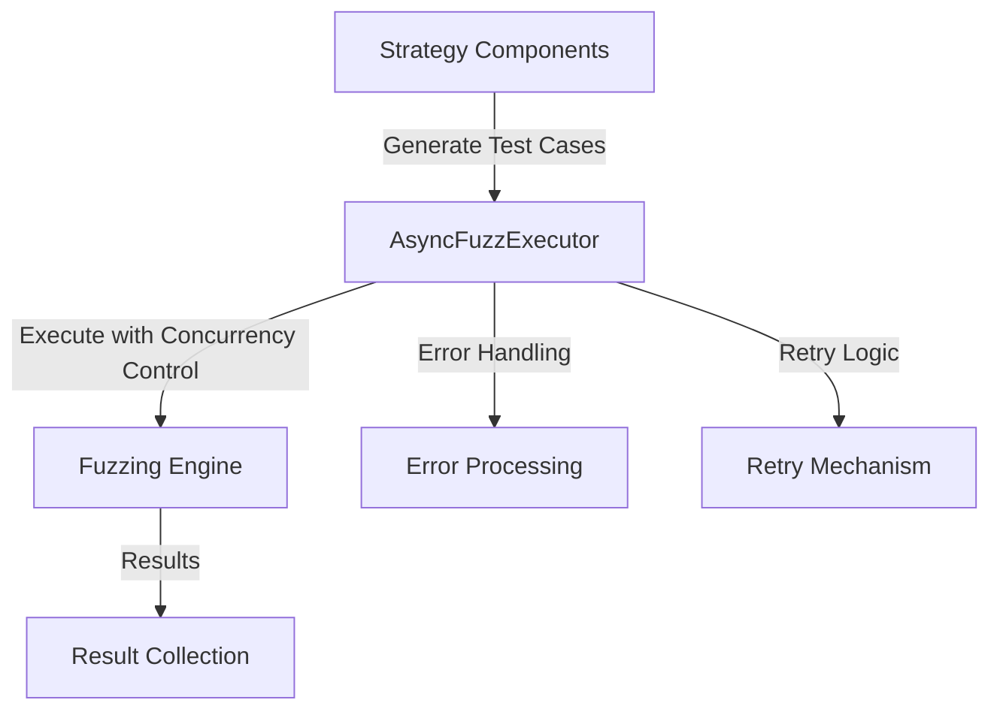

# Async Executor

The AsyncFuzzExecutor is a core component that bridges the strategy components (test case generators) and the fuzzing engine. It provides a robust asynchronous execution framework with concurrency control, error handling, and retry mechanisms.

## Architecture

The AsyncFuzzExecutor follows the executor pattern, providing a controlled environment for executing asynchronous operations:



## Features

- **Concurrency Control**: Limits the number of concurrent operations to prevent resource exhaustion
- **Timeout Handling**: Enforces timeouts on operations to prevent hanging
- **Error Handling**: Captures and processes exceptions from operations
- **Retry Mechanism**: Automatically retries failed operations with exponential backoff
- **Batch Execution**: Executes multiple operations concurrently with result aggregation
- **Resource Management**: Proper cleanup of resources during shutdown

## Usage

### Basic Execution

```python
from mcp_fuzzer.fuzz_engine.executor import AsyncFuzzExecutor

# Create an executor with max concurrency of 5
executor = AsyncFuzzExecutor(max_concurrency=5)

# Execute an async operation
async def my_operation(value):
    # Some async operation
    return value * 2

result = await executor.execute(my_operation, 10)
```

### Retry Mechanism

```python
# Execute with retry
result = await executor.execute_with_retry(
    my_operation,
    10,
    retry_count=3,
    retry_delay=1.0
)
```

### Batch Execution

```python
# Define multiple operations
operations = [
    (my_operation, [5], {}),
    (my_operation, [10], {}),
    (my_operation, [15], {})
]

# Execute all operations concurrently
results = await executor.execute_batch(operations)

# Process successful results
for result in results["results"]:
    print(f"Success: {result}")

# Process errors
for error in results["errors"]:
    print(f"Error: {error}")
```

### Cleanup

```python
# Shutdown the executor and clean up resources
await executor.shutdown()
```

## Integration with Fuzzing Components

The AsyncFuzzExecutor is integrated with both the ToolFuzzer and ProtocolFuzzer components:

1. **Strategy Components**: Generate test cases based on schemas or specifications
2. **AsyncFuzzExecutor**: Manages the execution of test cases with proper concurrency control
3. **Fuzzing Engine**: Processes the results and provides feedback

This separation of concerns allows for better maintainability and scalability of the fuzzing system.

## Configuration Options

- **max_concurrency**: Maximum number of concurrent operations (default: 5)
- **timeout**: Default timeout for operations in seconds (default: 30.0)
- **retry_count**: Number of retries for failed operations (default: 1)
- **retry_delay**: Delay between retries in seconds (default: 1.0)
