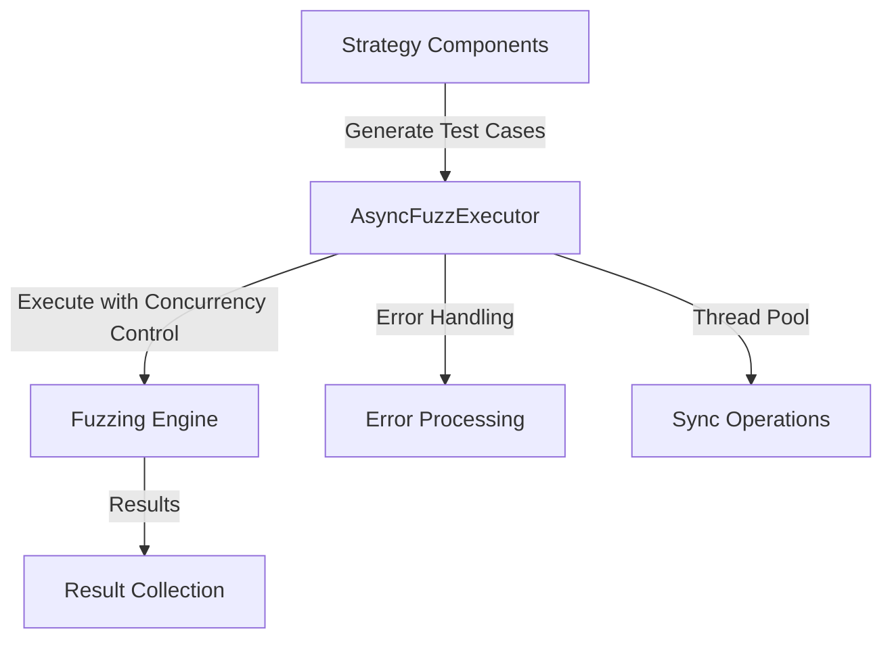

# Async Executor

The AsyncFuzzExecutor is a core component that bridges the strategy components (test case generators) and the fuzzing engine. It provides a robust asynchronous execution framework with semaphore-based concurrency control and error handling.

## Architecture

The AsyncFuzzExecutor follows the executor pattern, providing a controlled environment for executing asynchronous operations:



## Features

- **Concurrency Control**: Uses semaphore to limit the number of concurrent operations
- **Error Handling**: Captures and collects exceptions from operations automatically
- **Batch Execution**: Executes multiple operations concurrently with result aggregation
- **Mixed Execution**: Handles both async and sync operations via thread pool
- **Hypothesis Integration**: Wraps Hypothesis strategies to prevent asyncio deadlocks
- **Resource Management**: Proper cleanup of thread pool resources during shutdown

## Usage

### Batch Execution

```python
from mcp_fuzzer.fuzz_engine.executor import AsyncFuzzExecutor

# Create an executor with max concurrency of 5
executor = AsyncFuzzExecutor(max_concurrency=5)

try:
    # Define an async operation
    async def my_operation(value):
        # Some async operation
        return value * 2

    # Prepare operations as (function, args, kwargs) tuples
    operations = [
        (my_operation, [5], {}),
        (my_operation, [10], {}),
        (my_operation, [15], {})
    ]

    # Execute all operations concurrently
    results = await executor.execute_batch(operations)

    # Process successful results
    for result in results["results"]:
        print(f"Success: {result}")

    # Process errors
    for error in results["errors"]:
        print(f"Error: {error}")

finally:
    # Shutdown the executor and clean up resources
    await executor.shutdown()
```

### Error Handling

```python
async def operation_with_errors(value):
    if value % 2 == 0:
        raise ValueError(f"Even value not allowed: {value}")
    return value * 2

# Errors are automatically collected
operations = [(operation_with_errors, [i], {}) for i in range(10)]
results = await executor.execute_batch(operations)

print(f"Successful: {len(results['results'])}")
print(f"Failed: {len(results['errors'])}")
```

### Mixed Async and Sync Operations

```python
# Async operation
async def async_op():
    await asyncio.sleep(0.1)
    return "async"

# Sync operation (runs in thread pool)
def sync_op():
    return sum(range(1000))

operations = [
    (async_op, [], {}),
    (sync_op, [], {})
]

results = await executor.execute_batch(operations)
```

### Hypothesis Strategy Integration

```python
from hypothesis import strategies as st

# Run Hypothesis strategy without asyncio deadlocks
int_strategy = st.integers(min_value=0, max_value=100)
value = await executor.run_hypothesis_strategy(int_strategy)
```

## Integration with Fuzzing Components

The AsyncFuzzExecutor is integrated with both the ToolFuzzer and ProtocolFuzzer components:

1. **Strategy Components**: Generate test cases based on schemas or specifications
2. **AsyncFuzzExecutor**: Manages the execution of test cases with proper concurrency control
3. **Fuzzing Engine**: Processes the results and provides feedback

This separation of concerns allows for better maintainability and scalability of the fuzzing system.

## Configuration Options

- **max_concurrency**: Maximum number of concurrent operations (default: 5)

## API Methods

- `async execute_batch(operations) -> Dict[str, List]`: Execute a batch of operations
  - Operations format: `[(function, args, kwargs), ...]`
  - Returns: `{"results": [...], "errors": [...]}`

- `async run_hypothesis_strategy(strategy) -> Any`: Run Hypothesis strategy in thread pool

- `async shutdown() -> None`: Shutdown executor and clean up thread pool
