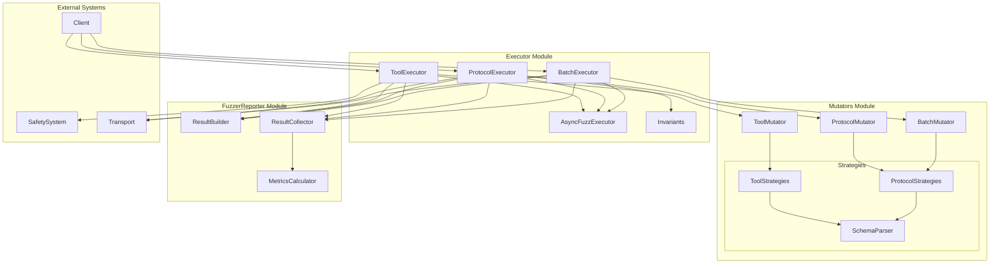
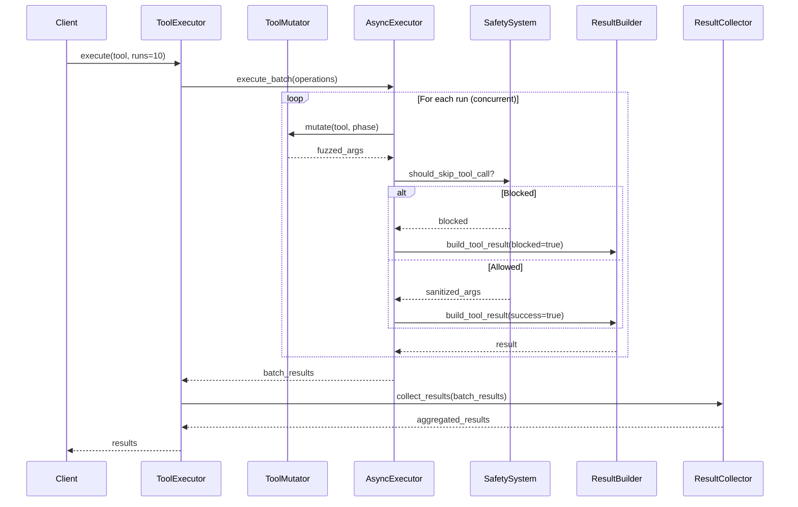
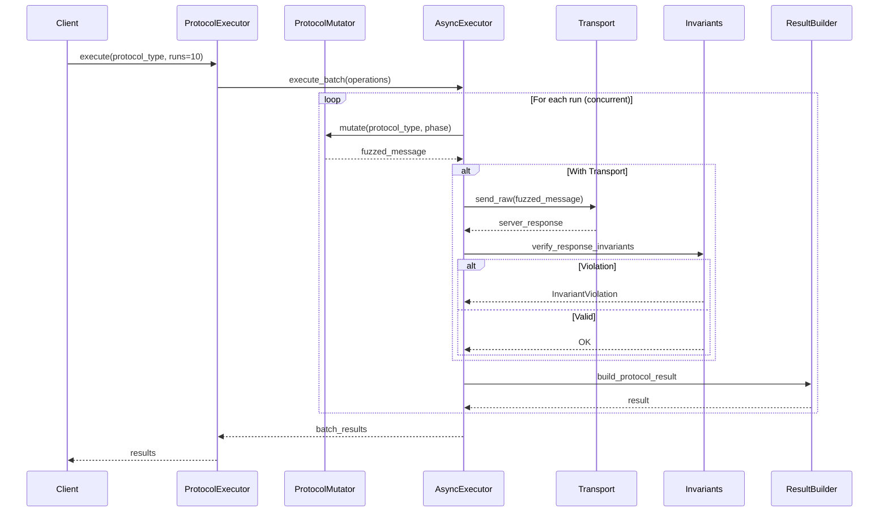

# Fuzz Engine Architecture

This document describes the architecture of the redesigned fuzz engine, which provides a modular, extensible system for testing MCP servers.

## Overview

The fuzz engine has been refactored into three distinct, specialized modules that follow clean separation of concerns:

1. **Mutators** - Data generation and mutation
2. **Executor** - Execution orchestration and coordination  
3. **FuzzerReporter** - Result collection and reporting

This modular design enables better testability, maintainability, and extensibility while maintaining high performance through asynchronous execution.

## Architecture Diagram



## Module Breakdown

### 1. Mutators Module

The Mutators module is responsible for generating and mutating test data. It provides three specialized mutators and a comprehensive strategy system.

#### Components

**Base Classes:**
- `Mutator` (ABC) - Defines the mutator interface

**Concrete Mutators:**
- `ToolMutator` - Generates fuzzed tool arguments based on JSON Schema
- `ProtocolMutator` - Generates fuzzed protocol messages (requests, notifications, results)
- `BatchMutator` - Generates batch requests with mixed protocol types

**Strategy System:**
- `ToolStrategies` - Tool-specific data generation strategies
- `ProtocolStrategies` - Protocol message generation strategies
- `SchemaParser` - JSON Schema-based data generation
- `Realistic Strategies` - Valid, schema-compliant data
- `Aggressive Strategies` - Edge cases, malformed data, attack vectors

#### ToolMutator

Generates fuzzed arguments for MCP tools based on their JSON Schema specifications.

```python
class ToolMutator(Mutator):
    """Generates fuzzed tool arguments."""
    
    def __init__(self):
        self.strategies = ToolStrategies()
    
    async def mutate(
        self, tool: dict[str, Any], phase: str = "aggressive"
    ) -> dict[str, Any]:
        """Generate fuzzed arguments for a tool."""
        return await self.strategies.fuzz_tool_arguments(tool, phase=phase)
```

**Features:**
- Schema-aware argument generation
- Support for realistic and aggressive phases
- Handles nested objects and arrays
- Generates boundary values and edge cases

#### ProtocolMutator

Generates fuzzed MCP protocol messages including requests, notifications, and results.

```python
class ProtocolMutator(BaseMutator):
    """Generates fuzzed protocol messages."""
    
    def __init__(self):
        self.strategies = ProtocolStrategies()
        self._logger = logging.getLogger(__name__)
    
    async def mutate(
        self, protocol_type: str, phase: str = "aggressive"
    ) -> dict[str, Any]:
        """Generate fuzzed data for a specific protocol type."""
        fuzzer_method = self.strategies.get_protocol_fuzzer_method(
            protocol_type, phase
        )
        # ... execution logic
```

**Supported Protocol Types:**
- Requests: InitializeRequest, ListResourcesRequest, CallToolRequest, etc.
- Notifications: ProgressNotification, CancelNotification, etc.
- Results: InitializeResult, ListToolsResult, etc.
- Content Types: TextContent, ImageContent, AudioContent
- Resources: Resource, ResourceTemplate, Tool definitions

#### BatchMutator

Generates batch requests containing multiple protocol messages.

```python
class BatchMutator(BaseMutator):
    """Generates fuzzed batch requests."""
    
    async def mutate(
        self, protocol_types: list[str] | None = None, phase: str = "aggressive"
    ) -> list[dict[str, Any]]:
        """Generate a batch request with mixed protocol types."""
        return self.strategies.generate_batch_request(
            protocol_types=protocol_types, phase=phase
        )
```

**Features:**
- Generates batches with 2-5 mixed protocol types
- Tests batch processing edge cases
- Supports notifications mixed with requests
- Generates various ID formats and edge cases

### 2. Executor Module

The Executor module orchestrates fuzzing execution, managing concurrency, safety checks, and invariant validation.

#### Components

**Core Executors:**
- `ToolExecutor` - Orchestrates tool fuzzing with safety integration
- `ProtocolExecutor` - Orchestrates protocol fuzzing with invariant checking
- `BatchExecutor` - Orchestrates batch request fuzzing

**Supporting Components:**
- `AsyncFuzzExecutor` - Provides async execution with concurrency control
- `Invariants` - Response validation and property-based testing

#### ToolExecutor

Orchestrates tool fuzzing by integrating mutators, safety checks, and result collection.

```python
class ToolExecutor:
    """Orchestrates tool fuzzing execution."""
    
    def __init__(
        self,
        mutator: ToolMutator,
        executor: AsyncFuzzExecutor | None = None,
        result_builder: ResultBuilder | None = None,
        safety_system: SafetyProvider | None = None,
        enable_safety: bool = True,
        max_concurrency: int = 5,
    ):
        self.mutator = mutator
        self.executor = executor or AsyncFuzzExecutor(max_concurrency)
        self.result_builder = result_builder or ResultBuilder()
        self.safety_system = safety_system or SafetyFilter() if enable_safety else None
    
    async def execute(
        self, tool: dict[str, Any], runs: int = 10, phase: str = "aggressive"
    ) -> list[FuzzDataResult]:
        """Execute fuzzing runs for a tool."""
```

**Key Features:**
- Integrates with safety system for dangerous operation detection
- Supports safety sanitization and blocking
- Concurrent execution with bounded concurrency
- Automatic error collection and reporting
- Two-phase fuzzing (realistic and aggressive)

**Safety Integration:**
- Checks if tool calls should be skipped (e.g., dangerous file operations)
- Sanitizes arguments to remove dangerous content
- Tracks blocked operations and safety events
- Generates safe mock responses for blocked operations

#### ProtocolExecutor

Orchestrates protocol fuzzing with invariant validation and batch response handling.

```python
class ProtocolExecutor:
    """Orchestrates fuzzing of MCP protocol types."""
    
    PROTOCOL_TYPES = (
        "InitializeRequest", "ProgressNotification", "CancelNotification",
        "ListResourcesRequest", "ReadResourceRequest", "SetLevelRequest",
        # ... 30+ protocol types
    )
    
    async def execute(
        self,
        protocol_type: str,
        runs: int = 10,
        phase: str = "aggressive",
        generate_only: bool = False,
    ) -> list[FuzzDataResult]:
        """Execute fuzzing runs for a specific protocol type."""
```

**Key Features:**
- Supports 30+ MCP protocol types
- Invariant validation for responses
- Batch response validation with timeout
- Optional transport integration for server testing
- Generate-only mode for data generation testing

**Invariant Validation:**
- Verifies JSON-RPC 2.0 compliance
- Checks error response structure
- Validates batch response consistency
- Detects invariant violations and reports them

#### BatchExecutor

Orchestrates batch request fuzzing with specialized batch handling.

```python
class BatchExecutor:
    """Orchestrates batch fuzzing execution."""
    
    async def execute(
        self,
        protocol_types: list[str] | None = None,
        runs: int = 5,
        phase: str = "aggressive",
        generate_only: bool = False,
    ) -> list[FuzzDataResult]:
        """Execute batch fuzzing runs."""
```

**Key Features:**
- Generates diverse batch compositions
- Tests server batch processing capabilities
- Validates batch response handling
- Supports mixed request/notification batches

#### AsyncFuzzExecutor

Provides the async execution framework with concurrency control and error handling.

```python
class AsyncFuzzExecutor:
    """Async execution framework with concurrency control."""
    
    def __init__(self, max_concurrency: int = 5):
        self.max_concurrency = max_concurrency
        self._semaphore = None
        self._tasks = set()
    
    async def execute_batch(
        self, operations: list[tuple]
    ) -> dict[str, list[Any]]:
        """Execute multiple operations concurrently with bounded concurrency."""
```

**Key Features:**
- Lazy semaphore initialization for async contexts
- Bounded concurrency to prevent resource exhaustion
- Supports both sync and async operations
- Automatic error collection
- Graceful cancellation handling
- Hypothesis strategy execution support

### 3. FuzzerReporter Module

The FuzzerReporter module handles result collection, aggregation, and metrics calculation.

#### Components

**Core Classes:**
- `ResultBuilder` - Creates standardized result dictionaries
- `ResultCollector` - Aggregates results from multiple runs
- `MetricsCalculator` - Calculates statistics and metrics

#### ResultBuilder

Creates standardized, typed result dictionaries for tool, protocol, and batch fuzzing.

```python
class ResultBuilder:
    """Builds standardized fuzzing results."""
    
    def build_tool_result(
        self,
        tool_name: str,
        run_index: int,
        success: bool,
        args: dict[str, Any] | None = None,
        original_args: dict[str, Any] | None = None,
        response: Any = None,
        exception: str | None = None,
        safety_blocked: bool = False,
        safety_reason: str | None = None,
        safety_sanitized: bool = False,
    ) -> FuzzDataResult:
        """Create standardized tool fuzzing result."""
    
    def build_protocol_result(...) -> FuzzDataResult:
        """Create standardized protocol fuzzing result."""
    
    def build_batch_result(...) -> FuzzDataResult:
        """Create standardized batch fuzzing result."""
```

**Result Types:**
- Tool results with safety metadata
- Protocol results with invariant violations
- Batch results with composition information

#### ResultCollector

Aggregates and filters results from fuzzing operations.

```python
class ResultCollector:
    """Collects and aggregates fuzzing results."""
    
    def collect_results(
        self, batch_results: dict[str, list[Any]]
    ) -> list[FuzzDataResult]:
        """Process batch results from AsyncFuzzExecutor."""
    
    def filter_results(
        self, results: list[FuzzDataResult], success_only: bool = False
    ) -> list[FuzzDataResult]:
        """Filter results by success status."""
```

**Features:**
- Collects results from batch outputs into a flat list
- Filters None values and error payloads
- Supports success-only filtering via a flag

#### MetricsCalculator

Calculates comprehensive metrics from fuzzing results.

```python
class MetricsCalculator:
    """Calculates metrics from fuzzing results."""
    
    def calculate_tool_metrics(
        self, results: list[FuzzDataResult]
    ) -> dict[str, Any]:
        """Calculates metrics for tool fuzzing results."""
        # Returns: total_runs, successful_runs, failed_runs, success_rate,
        #          safety_blocked, safety_sanitized, exceptions
    
    def calculate_protocol_metrics(
        self, results: list[FuzzDataResult]
    ) -> dict[str, Any]:
        """Calculates metrics for protocol fuzzing results."""
        # Returns: total_runs, successful_runs, server_rejections,
        #          invariant_violations, success_rate, exceptions
    
    def calculate_overall_metrics(
        self, all_results: dict[str, list[FuzzDataResult]]
    ) -> dict[str, Any]:
        """Calculates overall metrics across all fuzzing types."""
```

**Metrics Types:**
- Tool metrics (success rate, safety events)
- Protocol metrics (server rejections, invariant violations)
- Overall metrics (aggregate statistics)

## Data Flow

### Tool Fuzzing Flow



### Protocol Fuzzing Flow



## Integration Points

### Client Integration

The fuzz engine integrates with clients through executor classes:

```python
# Tool Client
class ToolClient:
    def __init__(self, transport, safety_system):
        mutator = ToolMutator()
        self.executor = ToolExecutor(
            mutator=mutator,
            safety_system=safety_system,
            max_concurrency=5
        )
    
    async def fuzz_tool(self, tool, runs=10):
        return await self.executor.execute(tool, runs)

# Protocol Client
class ProtocolClient:
    def __init__(self, transport):
        self.mutator = ProtocolMutator()
        self.executor = ProtocolExecutor(
            mutator=self.mutator,
            transport=transport,
            max_concurrency=5
        )
    
    async def fuzz_protocol_type(self, protocol_type, runs=10):
        return await self.executor.execute(protocol_type, runs)
```

### Safety System Integration

The ToolExecutor integrates directly with the safety system:

```python
# Safety check before execution
if self.safety_system:
    if self.safety_system.should_skip_tool_call(tool_name, args):
        # Log and return blocked result
        return self.result_builder.build_tool_result(
            tool_name=tool_name,
            run_index=run_index,
            success=False,
            safety_blocked=True,
            safety_reason="Dangerous operation detected"
        )
    
    # Sanitize arguments
    sanitized_args = self.safety_system.sanitize_tool_arguments(
        tool_name, args
    )
```

### Transport Integration

The ProtocolExecutor optionally integrates with transport for server testing:

```python
if self.transport and not generate_only:
    try:
        if isinstance(fuzz_data, list):
            # Batch request
            batch_responses = await self.transport.send_batch_request(fuzz_data)
            server_response = self.transport.collate_batch_responses(
                fuzz_data, batch_responses
            )
        else:
            # Single request
            server_response = await self.transport.send_raw(fuzz_data)
    except Exception as server_exception:
        server_error = str(server_exception)
```

## Design Principles

### 1. Separation of Concerns

Each module has a single, well-defined responsibility:
- **Mutators**: Generate test data
- **Executor**: Orchestrate execution
- **FuzzerReporter**: Collect and report results

### 2. Dependency Injection

All executors use dependency injection for flexibility:
- Mutators can be swapped for custom implementations
- Safety systems can be customized
- Result builders can be extended
- Transport can be any implementation

### 3. Asynchronous by Default

All operations are asynchronous for performance:
- Concurrent fuzzing runs with bounded concurrency
- Non-blocking I/O operations
- Efficient resource utilization

### 4. Type Safety

Strong typing throughout for reliability:
- `FuzzDataResult` TypedDict for results
- Protocol classes for interfaces
- Type hints on all public APIs

### 5. Extensibility

Easy to extend with new capabilities:
- Add new mutators by implementing `BaseMutator`
- Add new strategies to strategy system
- Add new executors for new fuzzing types
- Add new result types to ResultBuilder

## Configuration

### Executor Configuration

```python
# Configure tool executor
tool_executor = ToolExecutor(
    mutator=ToolMutator(),
    executor=AsyncFuzzExecutor(max_concurrency=10),
    result_builder=ResultBuilder(),
    safety_system=SafetyFilter(),
    enable_safety=True,
    max_concurrency=10
)

# Configure protocol executor
protocol_executor = ProtocolExecutor(
    mutator=ProtocolMutator(),
    executor=AsyncFuzzExecutor(max_concurrency=5),
    result_builder=ResultBuilder(),
    transport=transport,
    max_concurrency=5
)
```

### Strategy Configuration

Strategies are configured through phase selection:

```python
# Realistic phase - valid, schema-compliant data
results = await executor.execute(tool, runs=10, phase="realistic")

# Aggressive phase - edge cases, malformed data
results = await executor.execute(tool, runs=10, phase="aggressive")

# Both phases
two_phase_results = await executor.execute_both_phases(
    tool, runs_per_phase=5
)
```

## Performance Characteristics

### Concurrency

- Default max concurrency: 5 concurrent operations
- Configurable per executor
- Lazy semaphore initialization
- Efficient task management

### Memory Usage

- Results collected in memory
- Streaming not currently supported
- Consider result filtering for large runs

### Execution Time

- Concurrent execution reduces total time
- Bounded by slowest operation in batch
- Typical: 10-100 runs in seconds

## Testing

### Unit Test Coverage

- **Mutators**: 83-100% coverage
- **Executors**: 96-100% coverage
- **FuzzerReporter**: 96-100% coverage

### Test Strategy

- Mock dependencies for isolation
- Test each component independently
- Integration tests for full workflows
- Property-based tests for invariants

## Migration Guide

### From Old to New API

```python
# Old API
from mcp_fuzzer.fuzz_engine.fuzzer import ToolFuzzer, ProtocolFuzzer

tool_fuzzer = ToolFuzzer(safety_system)
results = await tool_fuzzer.fuzz_tool(tool, runs=10)

protocol_fuzzer = ProtocolFuzzer()
results = await protocol_fuzzer.fuzz_protocol_type("InitializeRequest", runs=10)

# New API
from mcp_fuzzer.fuzz_engine.executor import ToolExecutor, ProtocolExecutor
from mcp_fuzzer.fuzz_engine.mutators import ToolMutator, ProtocolMutator

tool_executor = ToolExecutor(
    mutator=ToolMutator(),
    safety_system=safety_system
)
results = await tool_executor.execute(tool, runs=10)

protocol_executor = ProtocolExecutor(
    mutator=ProtocolMutator(),
    transport=transport
)
results = await protocol_executor.execute("InitializeRequest", runs=10)
```

## Future Enhancements

### Planned Features

1. **Streaming Results**: Stream results as they're generated
2. **Custom Strategies**: Plugin system for custom strategies
3. **Parallel Executors**: Multiple executors for different tool sets
4. **Result Persistence**: Save/load results from disk
5. **Enhanced Metrics**: More sophisticated metric calculation
6. **Coverage Tracking**: Track which code paths are exercised

### Extensibility Points

- Custom mutators for domain-specific testing
- Custom result builders for different report formats
- Custom executors for specialized fuzzing scenarios
- Custom collectors for advanced result filtering

## References

- [FUZZ_ENGINE_REDESIGN.md](../../FUZZ_ENGINE_REDESIGN.md) - Original redesign document
- [Architecture Overview](./architecture.md) - Overall system architecture
- [Safety System](../components/safety.md) - Safety system integration
- [Transport Layer](../transport/) - Transport integration
