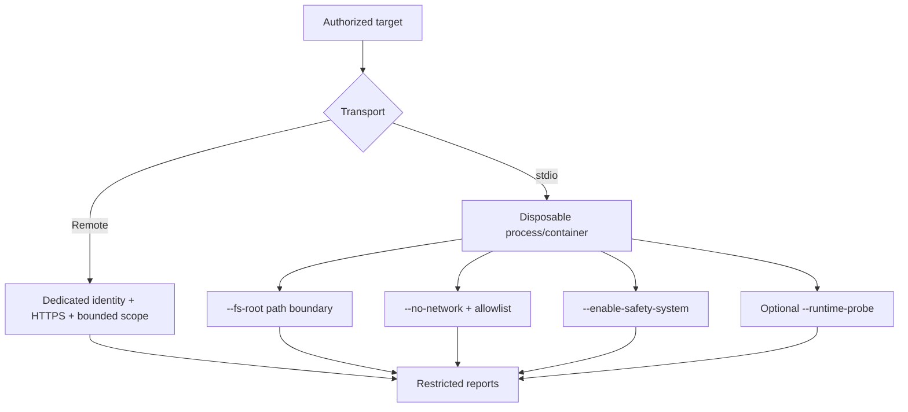

# Contain the target

Security assessment inputs can trigger real server behavior. Treat the fuzzer's
controls as layers that reduce accidental impact while you provide the actual
isolation boundary with a disposable process, container, VM, network segment,
or test account.



## Recommended local setup

Use a fresh sandbox for an untrusted or side-effectful stdio target:

```bash
mkdir -p fuzz-sandbox
mcp-fuzzer \
  --mode all \
  --protocol stdio \
  --endpoint "python my_server.py" \
  --phase aggressive \
  --enable-safety-system \
  --fs-root "$PWD/fuzz-sandbox" \
  --no-network \
  --runs 5 \
  --output-dir reports/isolated
```

Use a container or VM as well when the server code is not trusted. Delete or
reset the sandbox only after preserving the evidence required by the
assessment.

## Controls and their limits

| Control | What it does | What it does not guarantee |
| --- | --- | --- |
| `--enable-safety-system` | Places temporary command shims on the child process `PATH` to block selected external app/browser launches. | It is not a general syscall sandbox or complete command policy. |
| `--fs-root PATH` | Constrains fuzzer-generated filesystem paths to the configured root. | It cannot contain arbitrary host behavior outside the fuzzer's path handling. |
| `--no-network` | Restricts fuzzer transport access to local hosts unless hosts are explicitly allowed. | It is not a network namespace and may not contain every child-process network path. |
| `--allow-host HOST` | Adds a required host when `--no-network` is active; repeatable. | It is not permission to test an unapproved destination. |
| `--no-safety` | Disables argument-level safety filtering. | It should not be used as a convenience switch on an unisolated target. |
| `--runtime-probe` | Enables optional host observations for a local stdio process. | It does not monitor remote HTTP/SSE/Streamable HTTP servers. |

Argument-level safety is enabled by default. `--enable-safety-system` is
separate and must be requested for system-level command blocking.

## Runtime observation

The optional [mcpfz-probe](https://github.com/Agent-Hellboy/mcpfz-probe)
sidecar can report process execution, network connections, credential reads,
filesystem changes, privilege changes, and ptrace activity for stdio targets.
It is disabled by default and fails open if it cannot start or observe an event.

Use `--runtime-probe-backend fake` for portable fixture tests or `auto` to make
a capability-aware choice. The `ebpf` backend requires an isolated Linux runner
and appropriate privileges. Configure workspace/tmp roots and allowlists for
expected executables and hosts; unexpected events are observations for review,
not automatic proof of malicious intent.

## Network and credentials

- Prefer HTTPS for authorized remote assessments.
- Use dedicated credentials with the narrowest useful scope and expiry.
- Keep `Authorization`, cookies, OAuth secrets, and private headers out of
  public configuration and report artifacts.
- Use `--no-network` for local targets unless a test explicitly needs an
  approved destination.
- Treat OAuth metadata and redirect probes as part of the target's security
  boundary; use intrusive flags only with written authorization.

## Interpreting safety evidence

A blocked operation means a fuzzer boundary intercepted an attempted action. A
runtime finding means the sidecar observed behavior. Compare both against the
tool's stated purpose, target revision, test credentials, and authorization
scope. Neither alone establishes exploitability or business impact.

See [Interpret evidence and findings](../getting-started/results.md) for
triage and [evidence collection in CI](../security-ci.md) for artifact handling.
