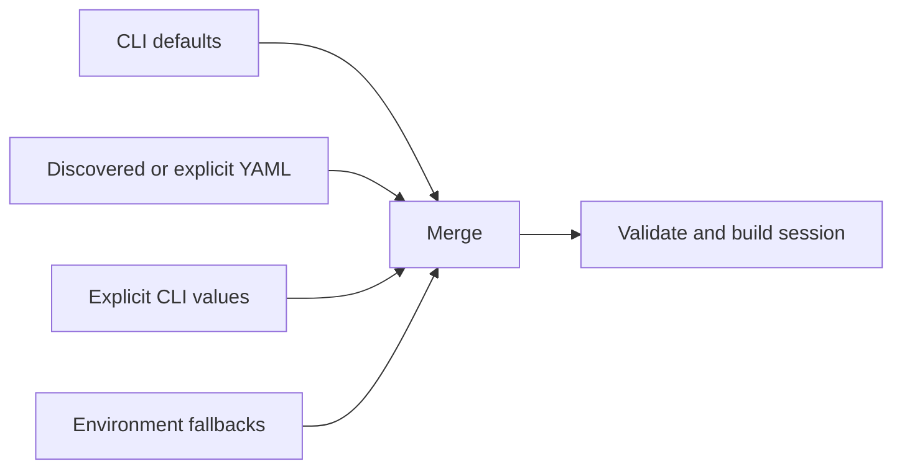

# Configuration discovery and layering

The configuration loader reads YAML and merges it with CLI arguments before a
session starts. Use this page to understand where a value came from; use
[configure a repeatable assessment](configuration.md) for target profiles.

## Discovery order

When `--config` is supplied, the fuzzer loads that `.yml` or `.yaml` file. When
it is omitted, the loader searches the configured default locations, including
the current directory's `mcp-fuzzer.yml` or `mcp-fuzzer.yaml` and the user
configuration directory.



Command-line values win over file values. A file value wins over a default.
Authentication resolution has its own priority; see
[authentication configuration](configuration.md#authentication-without-leaking-secrets).

## Minimal assessment file

```yaml
mode: tools
protocol: streamablehttp
endpoint: "https://target.example/mcp"
phase: realistic
runs: 10
seed: 42
security_audit: true
fail_if_no_tools: true
output:
  directory: reports/baseline
```

Override a single dimension without editing the file:

```bash
mcp-fuzzer --config assessment.yaml --phase aggressive --runs 20 \
  --output-dir reports/aggressive
```

## Supported sections

The main YAML sections are:

- top-level target and run settings such as `mode`, `protocol`, `endpoint`,
  `phase`, `runs`, `stateful`, and `spec_schema_version`;
- `output.directory`, `output.format`, `output.types`, and `output.schema`;
- `auth` provider definitions for YAML-driven authentication;
- `safety` settings for local host, header, proxy, and environment handling;
- `custom_transports` for maintainer-owned transport extensions.

CLI-shaped keys such as `security_audit`, `auth_audit`, `fail_if_no_tools`, and
runtime-probe settings can also be passed through the merged configuration.
Use the CLI reference for the exact flag spelling.

## Validation behavior

```bash
mcp-fuzzer --validate-config assessment.yaml
```

This verifies that the file can be read as YAML and that its top-level value is
a mapping. It does not connect to the target, validate authorization, prove
that credentials work, or certify that every optional setting is meaningful.

Use `--check-env` to validate known environment variables. Use
`--log-level DEBUG` when investigating how a config was discovered or merged.

## Safe handling

- Keep secrets in a restricted auth file or CI secret store, not in a committed
  YAML file.
- Record the config hash with an assessment so a reproduction can identify the
  exact settings without copying credentials.
- Treat config paths, endpoints, headers, and generated output as sensitive
  assessment metadata.
- Prefer one config per target and assessment phase rather than a single file
  containing unrelated credentials and permissions.
