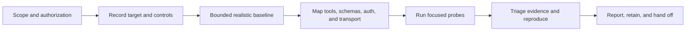

# Run a defensible MCP audit

This workflow is for an authorized security assessment where another analyst
must be able to understand what was tested, what happened, and what remains
uncertain.



## 1. Create the engagement record

Before the first request, record:

| Field | Example |
| --- | --- |
| Authorization | Ticket, assessment letter, or owner approval |
| Target identity | Server name, commit/image, environment, endpoint |
| Transport | `https`, `streamablehttp`, `sse`, or `stdio` |
| Authentication | Dedicated identity, scope, expiry, and auth source |
| Test window | Start/end time and timezone |
| Allowed effects | Read-only, test writes, registration, redirect probes, runtime observation |
| Data handling | Report location, retention, redaction, disclosure owner |
| Reproduction | CLI version, schema version, seed, config hash, command line |

Do not use production credentials or unapproved intrusive probes. The official
[MCP Security Best Practices](https://modelcontextprotocol.io/docs/tutorials/security/security_best_practices)
and [authorization specification](https://modelcontextprotocol.io/specification/2025-11-25/basic/authorization)
are useful review context, but the engagement's authorization and target
behavior determine what you may run.

## 2. Establish a baseline

Start with low volume and realistic values:

```bash
mcp-fuzzer \
  --mode tools \
  --protocol streamablehttp \
  --endpoint https://target.example/mcp \
  --phase realistic \
  --runs 10 \
  --seed 42 \
  --output-dir reports/01-baseline
```

For stdio, add `--enable-safety-system`, `--fs-root`, and usually
`--no-network`. For CI or target inventories, add `--fail-if-no-tools` so an
unreachable or protected endpoint cannot look like an empty clean result.

The baseline should answer:

- Was the endpoint reachable and correctly negotiated?
- What tools, resources, prompts, and protocol version were exposed?
- Which credentials and tool mappings were actually used?
- What normal success, rejection, timeout, and error responses look like?

## 3. Build a test matrix

Do not run every flag by default. Select the smallest matrix that answers the
research question:

| Surface | First pass | Expansion |
| --- | --- | --- |
| Tool arguments/results | `--mode tools --phase realistic` | `--phase aggressive`, `--tool NAME`, larger bounded `--runs` |
| Protocol messages | `--mode protocol --protocol-phase realistic` | Aggressive phase, `--protocol-type`, `--stateful` |
| Resources/prompts | `--mode resources` or `--mode prompts` | Supply the target-specific URI/name/arguments |
| Tool and schema metadata | `--security-audit` | Review each check's evidence and reproduce manually |
| OAuth boundary | `--auth-audit` | `--auth-audit-intrusive` only with explicit authorization |
| Local process behavior | stdio safety controls | `--runtime-probe` with explicit exec/host allowlists |
| Version behavior | Default negotiated version | `--spec-schema-version VERSION` for a target-specific comparison |

Use separate output directories for baseline, aggressive, auth, and runtime
runs. This preserves the comparison between normal behavior and probe-induced
behavior.

## 4. Exercise input and protocol boundaries

Aggressive inputs are useful when the target is isolated and the authorization
allows them:

```bash
mcp-fuzzer \
  --mode tools \
  --protocol https \
  --endpoint https://target.example/mcp \
  --phase aggressive \
  --security-audit \
  --runs 20 \
  --seed 42 \
  --output-dir reports/02-tools-aggressive
```

Interpret outcomes carefully:

- A well-formed protocol error or schema rejection is normally validation
  evidence, not a vulnerability.
- Accepted malformed input, unexpected side effects, sensitive output,
  transport anomalies, crashes, and reproducible state changes deserve review.
- A timeout or server error is a symptom to reproduce, not automatically a
  security finding.

## 5. Run security checks with clear boundaries

`--security-audit` combines read-only inspection of advertised tool/schema
content with selected evidence-backed output oracles. It can report signals
for poisoning, hidden instructions, ANSI/control content, duplicate or drifting
definitions, dangerous capability combinations, insecure remote transport, and
command/path/SQL/output-injection evidence from the same fuzz run.

`--auth-audit` reviews published OAuth metadata, authorization behavior, and
unauthenticated tool exposure when authentication is advertised. The default
path is read-only. Intrusive registration and redirect probes can change target
state and must be separately authorized.

These checks map to security research vocabulary and source material, including
the [OWASP MCP Top 10](https://owasp.org/www-project-mcp-top-10/). A mapping is
not a proof of exploitability or a final severity rating.

## 6. Reproduce before reporting

For each candidate finding, preserve:

1. The target revision and authorization scope.
2. The exact command, configuration path, schema version, seed, and tool or
   protocol type.
3. The finding ID/category, severity emitted by the tool, and evidence fields.
4. The request/input and the smallest relevant server response or runtime
   observation.
5. The expected secure behavior and the observed behavior.
6. A second run showing whether the behavior is deterministic, stateful, or
   intermittent.
7. Manual validation of exploitability, privilege, data sensitivity, and
   business impact.

Use [Interpret evidence and findings](results.md) for artifact handling. Keep
reports restricted until credentials, tokens, private paths, server responses,
and generated payloads have been reviewed and redacted.

## 7. Hand off or automate

An assessment handoff should include the scope record, test matrix, blocked or
completed status, findings, reproductions, limitations, and recommended next
tests. For repeatable checks, use [evidence collection in CI](../security-ci.md)
with private artifacts and an explicit policy for which reviewed categories
should fail a build.
