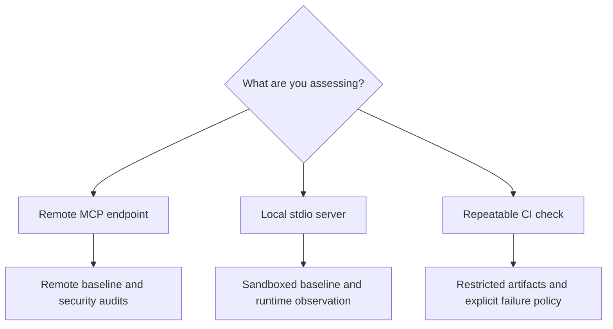

# Choose an assessment path

This section is organized around an analyst's work, not around the fuzzer's
internal modules. Pick the smallest workflow that answers your question, then
expand the scope only when the evidence justifies it.

## Choose your next task

| Your task | Start here |
| --- | --- |
| Install the CLI and verify a target | [Run a first assessment](getting-started.md) |
| Plan a defensible engagement or research session | [Follow the audit workflow](audit-workflow.md) |
| Exercise a transport, auth path, protocol mode, or local fixture | [Use audit recipes](examples.md) |
| Understand completion, blocked runs, and findings | [Interpret evidence and findings](results.md) |
| Reuse a target profile across sessions | [Configure repeatable assessments](../configuration/configuration.md) |
| Contain a local server or observe host behavior | [Safety and isolation](../components/safety.md) |
| Preserve evidence in a pipeline | [Automate evidence collection in CI](../security-ci.md) |
| Integrate with an internal parser or dashboard | [Standardized output](../development/standardized-output.md) |

## Assessment vocabulary

- **Discovery** records what the target advertises and what the fuzzer can
  reach; it is not a security verdict.
- **Baseline** uses bounded, realistic inputs to establish normal behavior,
  negotiated version, and the available attack surface.
- **Aggressive probing** introduces malformed, boundary, and attack-oriented
  values. A server rejection is usually useful evidence of validation, not a
  vulnerability.
- **Security audits** inspect the MCP surface and correlate selected oracles
  with evidence from the same run.
- **Finding** means an observation worth analyst review. Severity and business
  impact still require context outside the fuzzer.
- **Blocked assessment** means the run could not establish a usable target, for
  example because it was unreachable, protected, or exposed no tools. It is not
  a clean result.

## Supported target surfaces

- Tools and tool schemas.
- Protocol messages and learned stateful sequences.
- Resources and prompts through deterministic spec checks.
- HTTP, HTTPS, SSE, Streamable HTTP, and stdio transports.
- API-key, basic, bearer-token, custom-header, and OAuth flows configured for
  the authorized target.
- Optional process, filesystem, network, credential, privilege, and ptrace
  observations for local stdio targets.

The default MCP schema version is `2025-11-25`. Select a version explicitly with
`--spec-schema-version` when the target requires a different schema path; see
[configuration](../configuration/configuration.md#protocol-and-schema-version).

## Rules before you run

1. Record authorization, target revision, endpoint/command, credentials, test
   window, allowed side effects, and data-handling requirements.
2. Start with a disposable target, low run counts, and bounded timeouts.
3. Keep credentials out of command history where possible; prefer restricted
   files or environment variables and dedicated test identities.
4. Treat reports as sensitive until requests, responses, generated arguments,
   paths, and runtime observations have been reviewed.
