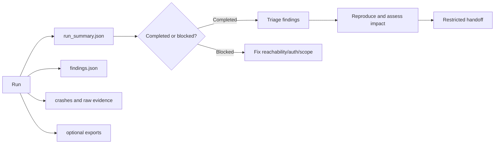

# Interpret evidence and findings

The fuzzer produces assessment evidence, not a one-line verdict. Start by
checking whether the target was usable, then interpret observations in the
context of the command, target revision, credentials, and test boundary.



## Artifact order

The output directory defaults to `reports/` and can be changed with
`--output-dir`.

| Artifact | What it answers | Analyst action |
| --- | --- | --- |
| `run_summary.json` | Did discovery and execution complete? How many tools/runs were usable? | Decide whether the result is comparable and complete |
| `findings.json` | Which security/reliability observations were normalized? | Read the category, severity, target, run, and evidence |
| `crashes/` | Can a crash or failure be replayed? | Preserve the smallest input and relevant server output |
| `sessions/<session-id>/*.json` | What standardized run snapshot was emitted? | Feed approved fields to parsers or dashboards |
| CSV/XML/HTML/Markdown export | What analyst-friendly view was requested? | Treat as a rendering of the run, not a new source of truth |

The standardized writer currently emits JSON for `fuzzing_results`,
`safety_summary`, and `error_report` when applicable. The accepted
`performance_metrics` and `configuration_dump` types are reserved. See
[standardized output](../development/standardized-output.md) for the contract
and its current limitations.

## 1. Determine whether the run is usable

Read `run_summary.json` before reading the finding count. `status` is the first
field to check; it is always either `completed` or `blocked`.

```json
{
  "mode": "tools",
  "status": "completed",
  "tool_discovery": {
    "failure": "none",
    "detail": "Discovered 3 tool(s)",
    "tool_count": 3
  },
  "tools": {
    "total": 3,
    "total_runs": 30,
    "by_name": {
      "echo_tool": {
        "total_runs": 10,
        "successful": 8,
        "failures": 2,
        "exceptions": 0,
        "safety_blocked": 0,
        "success_rate": 80.0,
        "outcomes": {
          "server_rejected": 1,
          "accepted_malformed": 1,
          "anomaly": 0,
          "crashed": 0,
          "exceptions": 0,
          "safety_blocked": 0
        }
      }
    }
  },
  "protocols": { "total": 0, "total_runs": 0, "by_type": {} },
  "findings": {
    "total": 2,
    "by_category": { "accepted_malformed": 1, "injection_reflection": 1 }
  }
}
```

Treat the two states differently:

- **`completed`:** discovery and the selected work ran. Review `tools.total`,
  `tools.total_runs`, and the per-tool `outcomes` buckets before drawing
  conclusions. A completed run with zero findings is not a clean bill of health;
  it is one bounded observation.
- **`blocked`:** the target could not be established. The summary adds
  `blocked_reason` and `blocked_detail` (for example `process_crashed` or a
  discovery failure), and `tools`/`protocols` stay empty. This is an assessment
  gap, not a clean target, and must never be compared against a completed
  baseline.

The per-tool `outcomes` buckets are the fixed set `server_rejected`,
`accepted_malformed`, `anomaly`, `crashed`, `exceptions`, and `safety_blocked`.
`anomaly` aggregates transport errors, timeouts, oversized responses, and phase
or mutation failures. `success_rate` counts protocol-level success only; a
rejected attack payload is usually the correct behavior, so do not read the rate
as a security score.

Use `--fail-if-no-tools` when automation must turn an empty or unreachable
target into exit code 2. Use `--allow-empty-tools` only when zero-tool fixtures
are expected and explicitly allowed by the sweep policy.

## 2. Triage `findings.json`

The document is `{"findings": [...], "count": N}`. When a run produced audit
findings it also carries an `auth_audit` and/or `server_audit` section giving
the source paper and that section's `finding_count`.

Each finding has exactly these fields:

```json
{
  "category": "injection_reflection",
  "severity": "high",
  "kind": "tool",
  "target": "echo_tool",
  "run": 1,
  "detail": "A dangerous input token was reflected verbatim in the response (missing sanitization boundary).",
  "evidence": { "marker": "<script>" }
}
```

| Field | Meaning |
| --- | --- |
| `category` | Stable machine-readable class, for example `accepted_malformed` or `injection_reflection`. This is the identifier to group and gate on. |
| `severity` | Emitted lowercase: `critical`, `high`, `medium`, `low`, or `info`. It is the tool's classification of the observation, not a rated risk for your deployment. |
| `kind` | `tool`, `protocol`, or `auth`. |
| `target` | Tool name, protocol type, or endpoint the observation belongs to. |
| `run` | Run index within the session, or `null` for findings not tied to one run. |
| `detail` | Human-readable description of what was observed. |
| `evidence` | Check-specific supporting data. Contents vary by check. |

There is no top-level finding ID. Findings produced by the server audit
(`--security-audit`) carry a stable check identifier at `evidence.check_id`, and
audit findings also carry `evidence.paper_arxiv_id`, `evidence.paper_url`, and
`evidence.paper_title`. Where a category maps to the OWASP MCP Top 10, evidence
adds `evidence.owasp_mcp_top_10` and `evidence.owasp_mcp_url`. Findings raised by
the fuzz classifiers rather than an audit check have no `check_id`; cite them by
`category` plus `target` and `run`.

For each finding, record:

1. `evidence.check_id` when present, otherwise `category`, plus the severity.
2. Target/tool/protocol type and run identifier.
3. Exact request or generated argument, when present.
4. Relevant response, stderr, timing, or runtime observation.
5. Paper and OWASP MCP references from `evidence`, when present.
6. Whether the behavior reproduced and under which credentials/state.

Use this interpretation ladder:

| Observation | Initial interpretation |
| --- | --- |
| Valid request rejected with a protocol error | Usually expected validation; retain as baseline evidence |
| Malformed input accepted and processed | Candidate input-validation finding; reproduce and assess impact |
| Error leaks paths, credentials, stack data, or internal topology | Candidate information-disclosure finding; redact before sharing |
| Tool metadata contains instructions or suspicious capability combinations | Security signal requiring client/model context and manual review |
| Timeout, crash, or transport anomaly | Reliability or availability candidate; reproduce and determine security impact |
| Runtime process/network/filesystem event | Observed behavior; compare with the tool's stated purpose and authorization |
| OAuth metadata or unauthenticated tool exposure signal | Authentication-boundary candidate; validate against the intended deployment |

A server rejecting an aggressive payload is not itself a vulnerability. A
security category or OWASP link is not a final severity decision.

## 3. Reproduce the smallest case

The report artifacts do not record everything a second analyst needs. In
particular the fuzzer does **not** write the seed, the MCP schema version, or the
invoking command line into `run_summary.json` or `findings.json`, and no
user-facing export carries a schema version for the report format itself. Those
belong in a reproduction record that you maintain beside the finding:

```yaml
# Analyst-maintained. None of these fields are emitted by the fuzzer.
finding: evidence.check_id or category
target_revision: commit-or-image
tool_version: output of `mcp-fuzzer --version`
schema_version: 2025-11-25    # the value you passed to --spec-schema-version
seed: 42                      # the value you passed to --seed
command: >-
  mcp-fuzzer --mode tools --protocol streamablehttp
  --endpoint https://target.example/mcp --phase aggressive
  --security-audit --seed 42 --runs 20
expected: server rejects the invalid value without side effects
observed: describe the response or runtime behavior
impact: analyst-owned assessment
```

Because the seed is not persisted, always pass `--seed` explicitly rather than
relying on the default random seed; an unseeded run cannot be reproduced from
its artifacts alone. The standardized output envelope does carry
`session_id`, `tool_version`, `timestamp`, and its own `protocol_version` — see
[standardized output](../development/standardized-output.md).

Repeat against a clean target state when the finding may be stateful. Preserve
the target revision, auth identity (not the secret), configuration hash, and
time window. A seed improves reproduction of generated payloads; it does not
make a remote or stateful target deterministic.

## 4. Protect the evidence

Reports may include generated arguments, server responses, tokens accidentally
returned by a target, private paths, environment details, and runtime events.

- Store artifacts privately with least-privilege access and retention.
- Redact credentials and target data before attaching them to a ticket.
- Keep an unredacted copy only where the engagement policy permits it.
- Do not treat HTML or Markdown exports as safe-to-publish summaries.
- Keep the startup configuration display's `[REDACTED]` values separate from
  report-content redaction; response bodies are not automatically sanitized.

For repeatable automation, see [evidence collection in CI](../security-ci.md).
For a complete assessment sequence, see the [audit workflow](audit-workflow.md).
