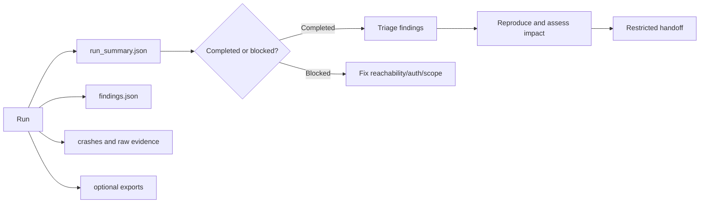

# Interpret evidence and findings

The fuzzer produces assessment evidence, not a one-line verdict. Start by
checking whether the target was usable, then interpret observations in the
context of the command, target revision, credentials, and test boundary.



## Artifact order

The output directory defaults to `reports/` and can be changed with
`--output-dir`.

| Artifact | What it answers | Analyst action |
| --- | --- | --- |
| `run_summary.json` | Did discovery and execution complete? How many tools/runs were usable? | Decide whether the result is comparable and complete |
| `findings.json` | Which security/reliability observations were normalized? | Read the check ID, evidence, target, run, and source references |
| `crashes/` | Can a crash or failure be replayed? | Preserve the smallest input and relevant server output |
| `sessions/<session-id>/*.json` | What standardized run snapshot was emitted? | Feed approved fields to parsers or dashboards |
| CSV/XML/HTML/Markdown export | What analyst-friendly view was requested? | Treat as a rendering of the run, not a new source of truth |

The standardized writer currently emits JSON for `fuzzing_results`,
`safety_summary`, and `error_report` when applicable. The accepted
`performance_metrics` and `configuration_dump` types are reserved. See
[standardized output](../development/standardized-output.md) for the contract
and its current limitations.

## 1. Determine whether the run is usable

Read `run_summary.json` before reading the finding count. A minimal summary may
look like:

```json
{
  "status": "completed",
  "mode": "tools",
  "tools_fuzzed": 3,
  "total_tool_runs": 30,
  "findings": 2
}
```

Treat these states differently:

- **Completed:** discovery and the selected work ran; review the coverage and
  counters before drawing conclusions.
- **Blocked:** the endpoint was unreachable, authentication prevented useful
  discovery, or no usable tools were available. This is an assessment gap, not
  a clean target.
- **Partial or errored:** some evidence may still be useful, but record the
  failure and do not compare it with a complete baseline without qualification.

Use `--fail-if-no-tools` when automation must turn an empty or unreachable
target into exit code 2. Use `--allow-empty-tools` only when zero-tool fixtures
are expected and explicitly allowed by the sweep policy.

## 2. Triage `findings.json`

For each finding, record:

1. `check_id` or category and emitted severity.
2. Target/tool/protocol type and run identifier.
3. Exact request or generated argument, when present.
4. Relevant response, stderr, timing, or runtime observation.
5. Source references and OWASP MCP mapping, when present.
6. Whether the behavior reproduced and under which credentials/state.

Use this interpretation ladder:

| Observation | Initial interpretation |
| --- | --- |
| Valid request rejected with a protocol error | Usually expected validation; retain as baseline evidence |
| Malformed input accepted and processed | Candidate input-validation finding; reproduce and assess impact |
| Error leaks paths, credentials, stack data, or internal topology | Candidate information-disclosure finding; redact before sharing |
| Tool metadata contains instructions or suspicious capability combinations | Security signal requiring client/model context and manual review |
| Timeout, crash, or transport anomaly | Reliability or availability candidate; reproduce and determine security impact |
| Runtime process/network/filesystem event | Observed behavior; compare with the tool's stated purpose and authorization |
| OAuth metadata or unauthenticated tool exposure signal | Authentication-boundary candidate; validate against the intended deployment |

A server rejecting an aggressive payload is not itself a vulnerability. A
security category or OWASP link is not a final severity decision.

## 3. Reproduce the smallest case

Keep a reproduction record beside the finding:

```yaml
finding: CHECK_ID_OR_CATEGORY
target_revision: commit-or-image
tool_version: mcp-fuzzer-version
schema_version: 2025-11-25
seed: 42
command: >-
  mcp-fuzzer --mode tools --protocol streamablehttp
  --endpoint https://target.example/mcp --phase aggressive
  --security-audit --seed 42 --runs 20
expected: server rejects the invalid value without side effects
observed: describe the response or runtime behavior
impact: analyst-owned assessment
```

Repeat against a clean target state when the finding may be stateful. Preserve
the target revision, auth identity (not the secret), configuration hash, and
time window.

## 4. Protect the evidence

Reports may include generated arguments, server responses, tokens accidentally
returned by a target, private paths, environment details, and runtime events.

- Store artifacts privately with least-privilege access and retention.
- Redact credentials and target data before attaching them to a ticket.
- Keep an unredacted copy only where the engagement policy permits it.
- Do not treat HTML or Markdown exports as safe-to-publish summaries.
- Keep the startup configuration display's `[REDACTED]` values separate from
  report-content redaction; response bodies are not automatically sanitized.

For repeatable automation, see [evidence collection in CI](../security-ci.md).
For a complete assessment sequence, see the [audit workflow](audit-workflow.md).
