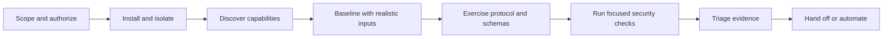

# MCP server security assessment with evidence

MCP Server Fuzzer is a black-box assessment client for security researchers,
auditors, and engineers validating an authorized
[Model Context Protocol](https://modelcontextprotocol.io/) server.

It discovers the target's exposed surface, exercises tools and protocol
messages, runs focused MCP security checks, and preserves the observations
needed for a second analyst to reproduce the result.

## Start with the question you need to answer

| Assessment question | Use | Evidence to review |
| --- | --- | --- |
| What does the server expose? | `--mode tools`, `resources`, or `prompts` | Discovery metadata and negotiated protocol version |
| Does input handling match the advertised schema? | `--phase realistic` then `--phase aggressive` | Requests, responses, rejection/acceptance outcome, timing |
| Are protocol boundaries robust? | `--mode protocol`, optionally `--stateful` | Per-message outcomes and spec-guard results |
| Does the advertised security boundary hold? | `--security-audit` and `--auth-audit` | Check IDs, evidence, source references, and auth metadata |
| What does a local server do on the host? | `stdio` plus safety controls and optional `--runtime-probe` | Process, network, filesystem, credential, and privilege observations |
| Can a pipeline detect an unusable target? | `--fail-if-no-tools` | Non-zero exit for no tools, auth failure, or unreachable target |

The fuzzer reports observations and useful reproductions. It does not certify a
server, prove exploitability in every deployment, or replace manual review of
authorization, business impact, and deployment context.

## The assessment loop

Every stage has a task-focused guide:

1. [Choose an assessment path](getting-started/index.md)
2. [Run a first assessment](getting-started/getting-started.md)
3. [Follow the audit workflow](getting-started/audit-workflow.md)
4. [Use focused recipes and local fixtures](getting-started/examples.md)
5. [Interpret and preserve evidence](getting-started/results.md)

## What the assessment can cover

- Tool arguments, result content, and schema constraints.
- Protocol requests, notifications, stateful sequences, resources, prompts,
  and deterministic spec checks.
- HTTP, HTTPS, SSE, Streamable HTTP, and stdio transports.
- API-key, basic, bearer-token, custom-header, and OAuth client-credentials
  authentication paths, plus MCP OAuth audit checks where supported.
- Tool/schema poisoning markers, hidden or encoded instructions, ANSI/control
  content, duplicate or drifting definitions, dangerous capability combinations,
  cleartext remote transport, and evidence-backed injection oracles.
- Optional host-level observations for local stdio processes through
  [mcpfz-probe](https://github.com/Agent-Hellboy/mcpfz-probe).

For the exact flags and current defaults, use the
[CLI reference](development/reference.md). For protocol-version selection, see
[configuration](configuration/configuration.md).

## Safety boundary

Only test systems you are authorized to assess. Use dedicated credentials,
bounded timeouts, low initial run counts, and a disposable target. For local
stdio targets, combine `--enable-safety-system` with `--fs-root` and usually
`--no-network`. These controls reduce accidental impact but are not an OS
sandbox or a replacement for a container/VM.

## Security context

Use this tool alongside the official
[MCP Security Best Practices](https://modelcontextprotocol.io/docs/tutorials/security/security_best_practices),
[MCP authorization specification](https://modelcontextprotocol.io/specification/2025-11-25/basic/authorization),
and [OWASP MCP Top 10](https://owasp.org/www-project-mcp-top-10/). The project
links applicable sources in finding evidence; a mapping is context for analyst
triage, not a severity decision by itself.

## Project resources

- [Maintained local example servers](getting-started/examples.md)
- [Configuration](configuration/configuration.md)
- [Safety and isolation](components/safety.md)
- [Security evidence in CI](security-ci.md)
- [Standardized output](development/standardized-output.md)
- [Contributing](development/contributing.md)
- [GitHub repository](https://github.com/Agent-Hellboy/mcp-server-fuzzer)
- [PyPI package](https://pypi.org/project/mcp-fuzzer/)
