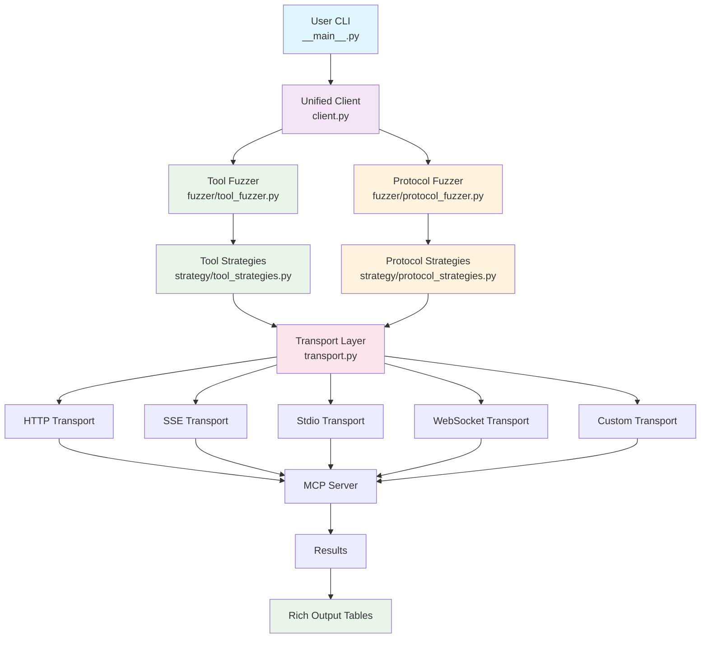
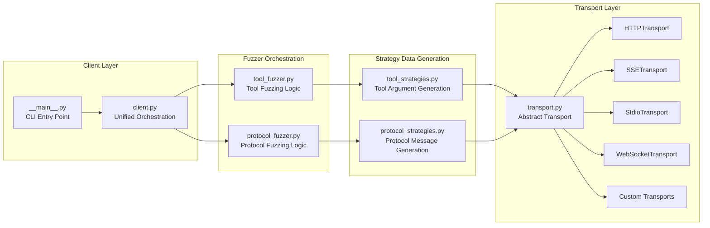
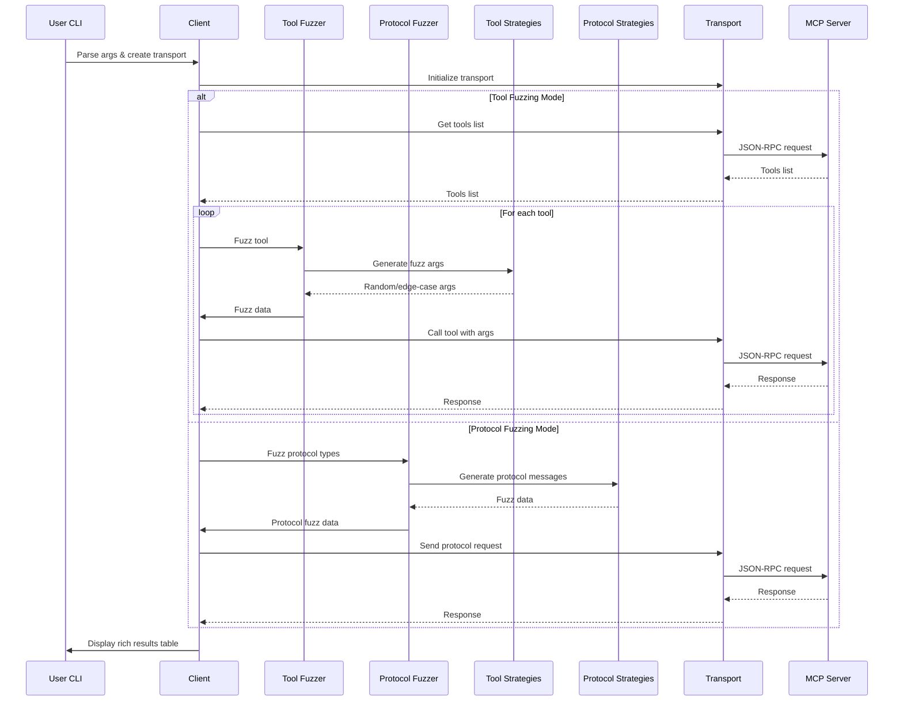
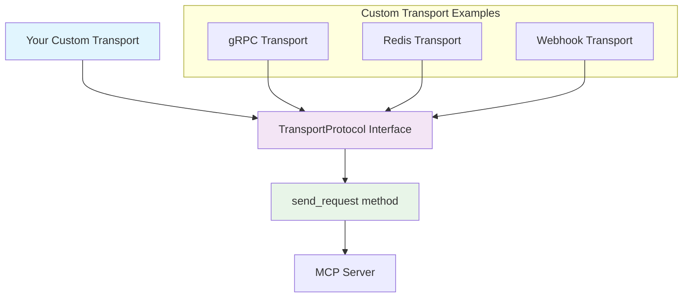
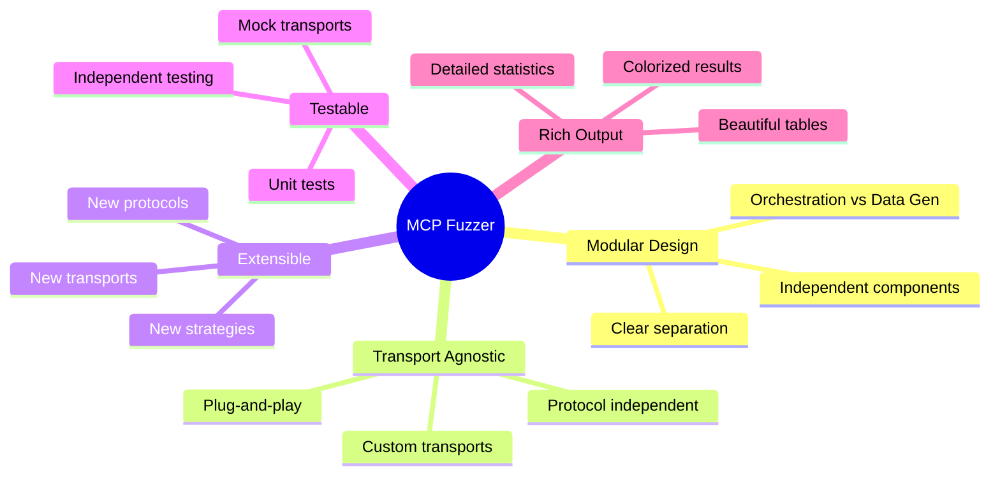
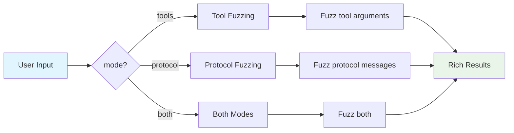

# MCP Fuzzer Architecture - Mermaid Diagram

## Main Architecture Flow

## Detailed Component Breakdown

## Data Flow Sequence

## Custom Transport Integration

## Key Benefits Visualization

## Usage Modes

