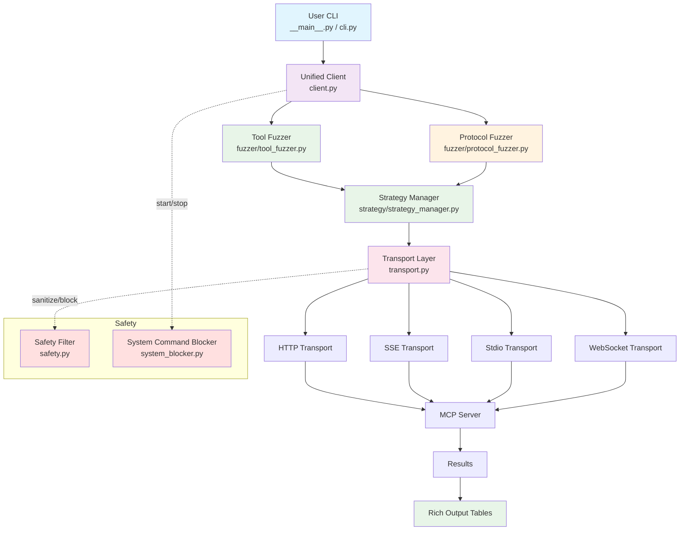
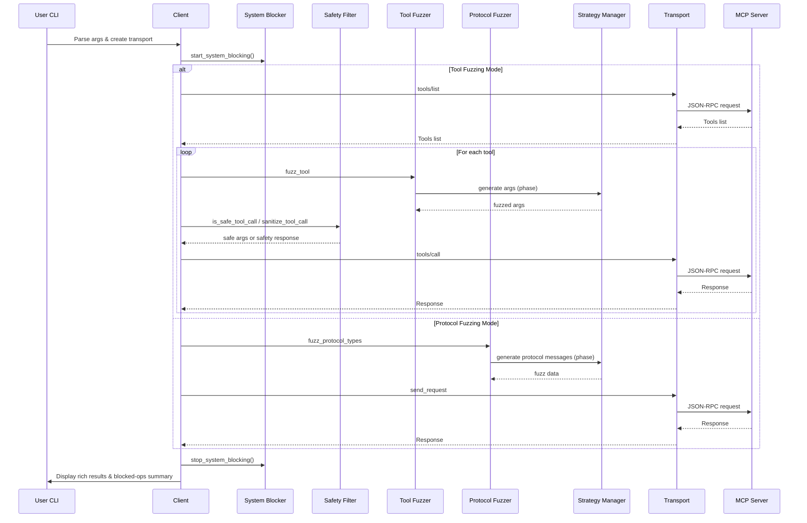
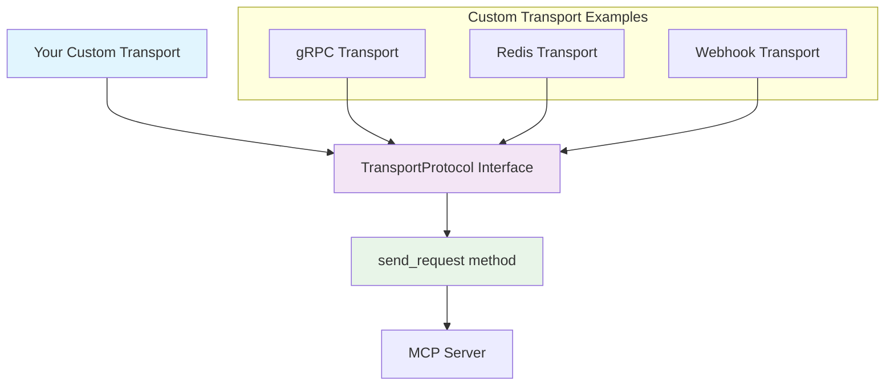
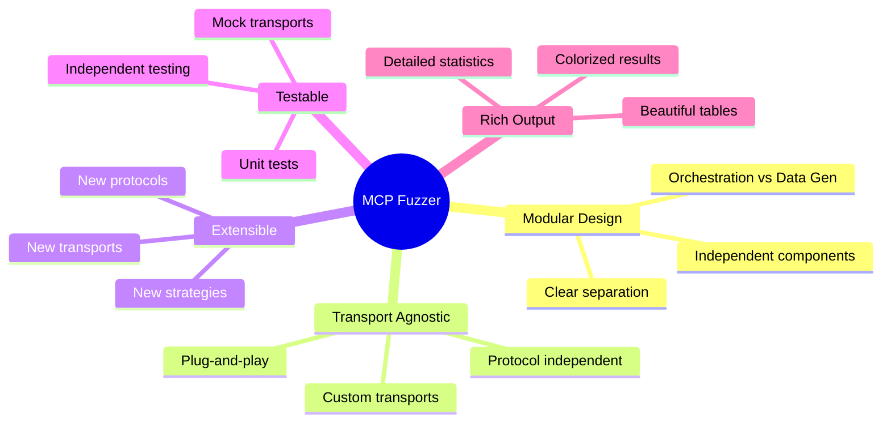
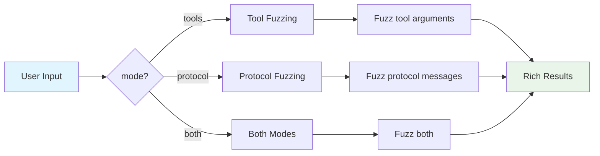

# MCP Fuzzer Architecture - Mermaid Diagram

## Main Architecture Flow



## Detailed Component Breakdown

```mermaid
graph LR
    subgraph "Client Layer"
        A[__main__.py / cli.py<br/>CLI Entry Point]
        B[client.py<br/>Unified Orchestration]
    end

    subgraph "Fuzzer Orchestration"
        C[tool_fuzzer.py<br/>Tool Fuzzing Logic]
        D[protocol_fuzzer.py<br/>Protocol Fuzzing Logic]
    end

    subgraph "Strategy Data Generation"
        E[strategy_manager.py<br/>Dispatch (realistic/aggressive)]
        ER[realistic/*]
        EA[aggressive/*]
    end

    subgraph "Safety"
        SF[safety.py<br/>Argument-level safety]
        SB[system_blocker.py<br/>System-level blocking]
    end

    subgraph "Transport Layer"
        G[transport.py<br/>Abstract Transport]
        H[HTTPTransport]
        I[SSETransport]
        J[StdioTransport]
        K[WebSocketTransport]
    end

    A --> B
    B --> C
    B --> D
    C --> E
    D --> E
    E --> ER
    E --> EA
    E --> G
    G --> SF
    B --> SB
    G --> H
    G --> I
    G --> J
    G --> K
```

## Data Flow Sequence



## Custom Transport Integration



## Key Benefits Visualization



## Usage Modes


