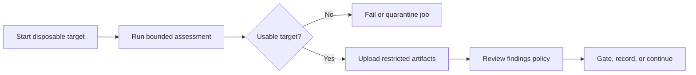

# Automate repeatable assessment evidence

CI is useful for repeatable regression evidence when the job owns the target,
credentials, network boundary, and artifact retention. It is not a substitute
for authorization or analyst review.



## A minimal pipeline

Run against a local test target or an endpoint explicitly owned by the job:

```yaml
- name: Assess MCP server
  run: |
    mcp-fuzzer \
      --mode all \
      --protocol streamablehttp \
      --endpoint http://127.0.0.1:8000/mcp \
      --phase aggressive \
      --security-audit \
      --fail-if-no-tools \
      --runs 10 \
      --seed 42 \
      --output-dir reports/mcp-fuzzer

- name: Upload restricted assessment evidence
  uses: actions/upload-artifact@v4
  with:
    name: mcp-fuzzer-evidence
    path: reports/mcp-fuzzer/
    retention-days: 7
```

Use a private artifact store and a retention period appropriate to the
engagement. Do not make raw response artifacts public by default.

## Decide what fails the job

The fuzzer provides exit behavior for target usability, not a universal risk
policy:

- `--fail-if-no-tools` exits non-zero when discovery yields no usable tools,
  including an unreachable or auth-blocked target.
- `--allow-empty-tools` opts out of the automatic CI/Docker behavior when a
  zero-tool fixture is expected.
- Findings are evidence for a project-specific policy. Define which check IDs,
  severities, or reproducibility states require a human-approved failure.
- Keep a blocked assessment distinct from a completed assessment with no
  findings.

Avoid a policy that fails on every server rejection. A correct rejection of a
malformed request is generally validation evidence; accepted malformed input,
unexpected side effects, sensitive output, crashes, and reproducible security
signals need analyst interpretation.

## Local stdio jobs

Run local servers in disposable containers or runners. Add the fuzzer safety
controls as a second boundary:

```bash
mcp-fuzzer \
  --mode tools \
  --protocol stdio \
  --endpoint "python my_server.py" \
  --enable-safety-system \
  --fs-root "$PWD/ci-fuzz-sandbox" \
  --no-network \
  --security-audit \
  --fail-if-no-tools \
  --runs 10 \
  --output-dir reports/mcp-fuzzer
```

Use `--allow-host` only for destinations required by the test. If runtime
behavior is in scope, enable `--runtime-probe` in a Linux runner with explicit
workspace, temporary-directory, executable, and host policies. Runtime probing
is separate from normal fuzzing and does not monitor remote transports.

## Authenticated and intrusive jobs

Use dedicated, short-lived credentials. Prefer a restricted auth file or CI
secret injection; never commit client secrets or tokens to the repository.

Run `--auth-audit` in a read-only job first. Place
`--auth-audit-intrusive` in a separate, explicitly authorized job because it
can create dynamic-registration state and exercise redirect handling. Do not
point that job at production.

## Artifact review checklist

Before a human or downstream system consumes the artifact:

- Confirm `run_summary.json` reports a completed, comparable assessment.
- Review `findings.json` and the exact evidence behind each candidate.
- Preserve `crashes/` only when the target owner permits the captured data.
- Redact credentials, tokens, private paths, personal data, and server secrets.
- Record the tool version, target revision, schema version, command, seed, and
  configuration hash.
- Link the artifact to the assessment scope and reviewer decision.

See [Interpret evidence and findings](getting-started/results.md) for the
analyst-side triage model.
